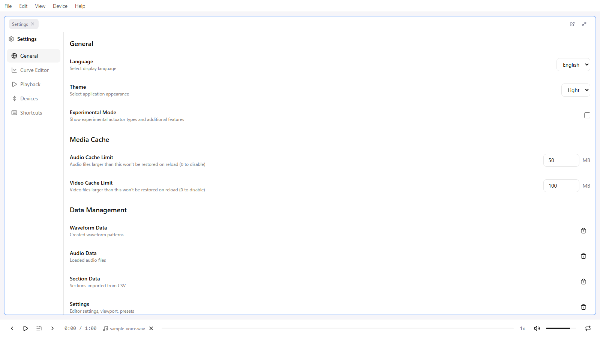

# Display and Layout

The remix-editor screen consists of multiple panels. Each panel can be moved, resized, and turned into a tab by dragging, so you can rearrange the layout freely to suit your workflow.

## Overall Layout

From top to bottom, the screen consists of three areas.

| Area | Contents |
|------|----------|
| Top | Menu bar |
| Center | Panel area (multiple panels you can arrange freely) |
| Bottom | Playback footer |

## Menu Bar

There are 5 menus.

| Menu | Main items |
|------|------------|
| File | Open Remix / Import Funscript / Import CSV / Load Audio / Import Section Data / Save Remix / Export Section Data / Import & Export Waveform Library |
| Edit | Undo / Redo / Settings (Ctrl + ,) |
| View | Layout ▸ (presets, lock, reset) / Panels ▸ (toggle each panel) |
| Device | Connect... / Disconnect |
| Help | Documentation / About remix-editor |

At the right end of the menu bar, a lock indicator appears while the layout is locked.

## Panel List

There are 9 panels. Show or hide each one with the checkboxes in **View > Panels**.

| Panel | Role | Details |
|-------|------|---------|
| Curve Editor | Main editing area | [Curve Editor](./06-curve-editor.md) |
| Patterns | Pattern list, settings, and device mapping | [Patterns](./03-patterns.md) |
| Devices | Intiface connection, device list, and test control | [Devices](./05-devices.md) |
| Sections | Display and edit section data | [Section Data](./08-sections.md) |
| Properties | Edit the selected point numerically | [Properties](./07-properties.md) |
| Waveform Generator | Procedurally generate sine, triangle, and other waveforms | [Waveform Generation](./09-waveform-generation.md) |
| Generate from Audio | Generate a waveform from audio volume | [Waveform Generation](./09-waveform-generation.md) |
| Throttle Control | Record values with a vertical slider while playing | [Curve Editor](./06-curve-editor.md#throttle-control) |
| Waveform Library | Manage saved waveform snippets in folders | [Waveform Library](./10-waveform-library.md) |

There is also a **Settings** panel, which you open when you need it with **Edit > Settings** (Ctrl + ,).

In the default layout, **Throttle Control** and **Waveform Library** are placed as tabs in the same group.

### Panel Header Actions

The right side of each panel header has the following buttons.

- **Gear**: Open the related settings category (Curve Editor and Devices only)
- **Open in New Window**: Detach the panel into an independent window
- **Maximize / Restore**: Temporarily expand the panel to fill the screen

While the layout is locked, actions such as maximizing are greyed out.

## Customizing the Layout

### Arranging Panels

- **Move**: Drag a tab to another position or group
- **Resize**: Drag a panel border
- **Tabbing**: Drop a panel onto another panel to put both in the same group as tabs

### Layout Presets

Choose a preset for your use case from **View > Layout**.

| Preset | Use case |
|--------|----------|
| Audio Mode (Simple) | Minimal setup for editing along audio |
| Audio Mode (Detailed) | Audio editing with the supporting panels laid out as well |
| Review Mode | Setup for playing back and reviewing a finished Remix |
| Simple Mode | Minimal setup for concentrating on curve editing |

Use **Reset** to return to the default layout.

### Locking the Layout

Use **View > Layout > Lock Layout** to fix the layout. While locked, panels cannot be moved, resized, or maximized, which prevents you from accidentally breaking the layout while editing.

You can also unlock it by clicking the lock indicator at the right end of the menu bar.

The layout and lock state are saved automatically and restored on the next launch.

## Footer (Playback Controls)

Handles audio playback and playback controls.

- **Transport**: Skip to Start / Play-Pause / Skip to End (when sections exist, these become Previous Section / Next Section buttons)
- **Play from Selection**
- **Time display**: Current playback position / total length
- **Media drop zone**: Drop and remove audio files
- **Seek slider**: Drag to change the playback position (snaps to the time step)
- **Playback Speed**: 0.25x / 0.5x / 0.75x / 1x / 1.25x / 1.5x / 2x
- **Volume and mute**
- **Loop**: Loop the selection if there is one, otherwise loop the whole timeline

### Play and Pause

- Toggle play/pause with the **Space** key or the play button
- Works no matter which panel is active

### Seek (Move Playback Position)

- Drag the seek slider in the footer (**snaps to the time step**)
- Click / drag the playhead area of the Curve Editor
- Click a row in the section table (moves to the start of that section)

### Playback Speed

Click the speed display in the footer to select from the speed list. You can also change it with **Shift + >** / **Shift + <**, which wrap around at max/min.

| Speed | Use case |
|-------|----------|
| 0.25x - 0.75x | Slow playback and detailed checking |
| 1x | Normal speed |
| 1.25x - 2x | Fast-forward review |

### Volume

- Adjust 0% to 100% with the volume slider
- Mute button for instant silence

### Loop Playback

Click the loop button to enable loop playback (the button is highlighted while enabled).

| Condition | Loop Range |
|-----------|------------|
| Selection exists | Selection |
| No selection | Whole timeline (audio length, or max time) |

While looping, playback automatically returns to the start position when reaching the end.

### Play from Selection

1. Select a range in the Curve Editor
2. Click the "Play from Selection" button in the footer

The button is disabled when there is no selection.

## Next Steps

- [Patterns](./03-patterns.md) - Creating and configuring patterns
- [Curve Editor](./06-curve-editor.md) - Editing operations in detail
