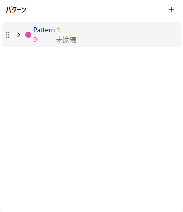
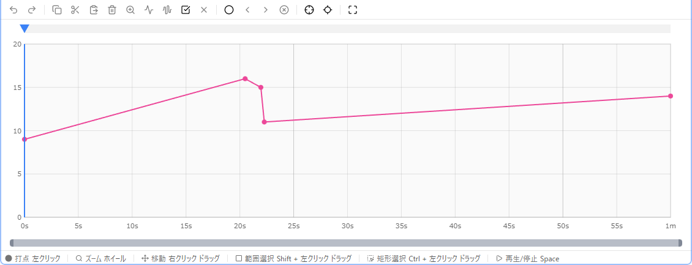
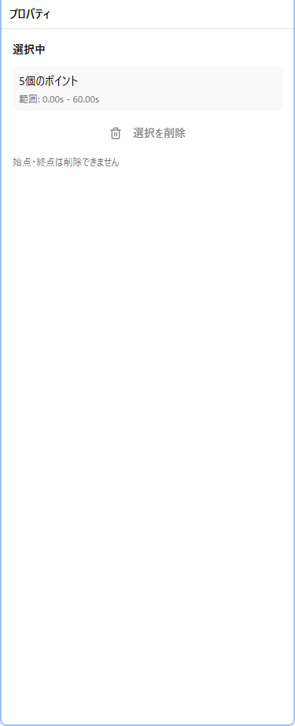
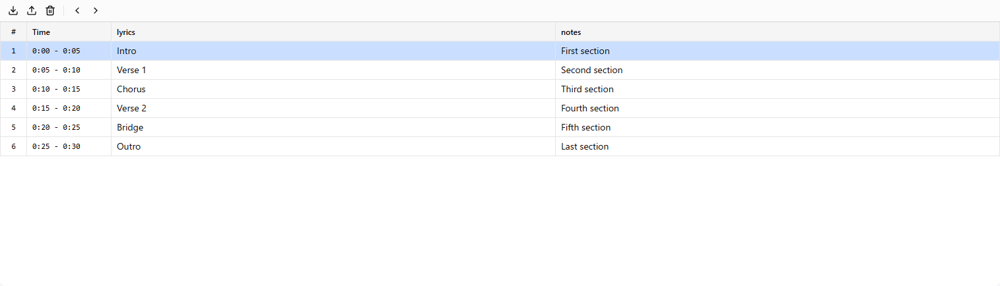

# UI Overview

The remix-editor interface consists of multiple panels. Each panel can be moved and resized by dragging.

## Overall Layout

The screen consists of the following areas:

| Area | Contents |
|------|----------|
| Header | Menu bar |
| Left Panel | Pattern list, device connection |
| Center Panel | Curve editor (main editing area) |
| Right Panel | Point editing, waveform generation tools |
| Footer | Audio player, playback controls |

## Pattern List

A panel for managing control patterns.

### Features

- **Add Pattern**: Create a new pattern with the "+" button
- **Select Pattern**: Click to switch the editing target
- **Delete Pattern**: Delete with the trash icon (confirmation dialog)
- **Rename**: Double-click to enter edit mode
- **Change Color**: Click the color icon
- **Show/Hide**: Toggle with the eye icon

### Pattern Settings

The following settings are available for each pattern:

- Maximum value (maxValue)
- Value step (quantization interval)
- Allow negative values
- Preferred device type
- Preferred actuator type

## Curve Editor

The main editing area. Edit points on a graph with time (horizontal axis) and value (vertical axis).

### Display Elements

- **Grid**: Time and value markings
- **Points**: Points that make up the curve
- **Curve Line**: Lines connecting points
- **Playhead**: Current playback position (red vertical line)
- **Selection**: Selected area (blue rectangle)
- **Background Waveform**: Audio waveform (optional)

### Operations

- **Left Click**: Add/select point
- **Drag**: Move point / selection
- **Right Drag**: Pan viewport
- **Wheel**: Zoom in/out
- **Shift + Drag**: Range selection

See [Curve Editing](./04-curve-editing.md) for details.

## Property Panel

Edit coordinates of selected points numerically.

- **Time**: Point's time position (seconds)
- **Value**: Point's value

Relative movement is available for multiple selections.

## Waveform Generator Panel

Generate waveform patterns in the selected range.

Supported waveforms:
- Sine wave
- Triangle wave
- Square wave
- Random wave
- Audio analysis waveform

See [Curve Editing > Waveform Generation](./04-curve-editing.md#waveform-generation) for details.

## Device Panel

Displays connection status with Intiface Central and device list.

- **Connect/Disconnect**: Control connection to Intiface
- **Scan**: Search for devices
- **Device List**: Show connected devices
- **Test Control**: Direct device control with slider

See [Device Connection](./06-devices.md) for details.

## Section Panel

Display and edit section data imported from CSV.

- **Section List**: Show time ranges and attributes
- **Navigation**: Move between sections with arrow keys
- **Set as Selection**: Set section range as selection
- **Waveform Generation**: Auto-generate waveforms from attribute values

See [Sections](./05-sections.md) for details.

## Footer

Audio playback and playback controls.

### Playback Controls

- **Play/Pause**: Space key or button
- **Stop**: Stop playback and return to start
- **Playback Speed**: 0.25x to 8x
- **Volume**: 0% to 100%
- **Repeat**: Loop playback of selection or viewport

### Audio Player

- **Waveform Display**: Show audio waveform
- **Seek**: Click waveform to change playback position
- **Current Time/Total Time**: Display playback position

## Panel Customization

Each panel can be customized with the following operations:

- **Move**: Drag the title bar
- **Resize**: Drag panel borders
- **Maximize**: Double-click the title bar

Layout is automatically saved and restored on next launch.
