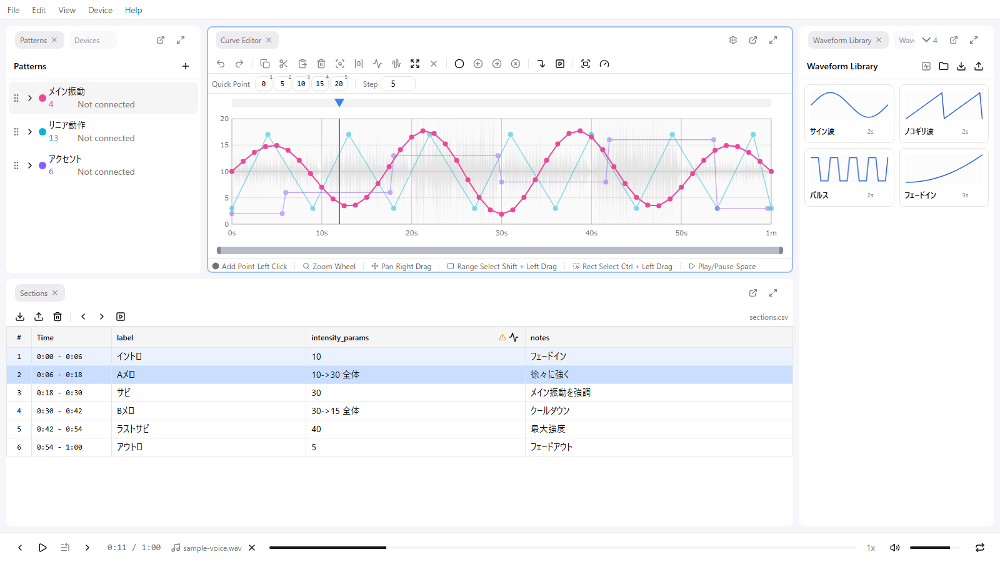
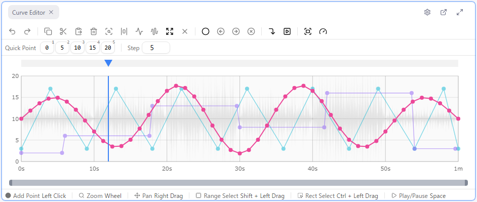
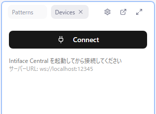
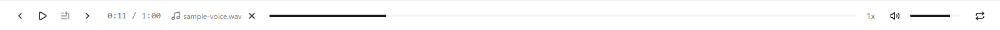

# UI Overview

The remix-editor screen consists of multiple panels. Each panel can be moved, resized, and turned into a tab by dragging.

## Overall Layout

From top to bottom, the screen consists of three areas.

| Area | Contents |
|------|----------|
| Top | Menu bar |
| Center | Panel area (multiple panels you can arrange freely) |
| Bottom | Playback footer |

## Menu Bar

There are 5 menus.

| Menu | Main items |
|------|------------|
| File | Open Remix / Import Funscript / Import CSV / Load Audio / Import Section Data / Save Remix / Export Section Data / Import & Export Waveform Library |
| Edit | Undo / Redo / Settings (Ctrl + ,) |
| View | Layout ▸ (presets, lock, reset) / Panels ▸ (toggle each panel) |
| Device | Connect... / Disconnect |
| Help | Documentation / About remix-editor |

At the right end of the menu bar, a lock indicator appears while the layout is locked.

## Panel List

There are 9 panels. Show or hide each one with the checkboxes in **View > Panels**.

| Panel | Role |
|-------|------|
| Curve Editor | Main editing area |
| Patterns | Pattern list, settings, and device mapping |
| Devices | Intiface connection, device list, and test control |
| Waveform Library | Manage saved waveform snippets in folders |
| Sections | Section data table and waveform generation |
| Properties | Edit the selected point numerically |
| Waveform Generator | Procedurally generate sine, triangle, and other waveforms |
| Generate from Audio | Generate a waveform from audio volume |
| Throttle Control | Record values with a vertical slider while playing |

There is also a **Settings** panel, which you open when you need it with **Edit > Settings** (Ctrl + ,).

In the default layout, **Throttle Control** and **Waveform Library** are placed as tabs in the same group.

### Panel Header Actions

The right side of each panel header has the following buttons.

- **Gear**: Open the related settings category (Curve Editor and Devices only)
- **Open in New Window**: Detach the panel into an independent window
- **Maximize / Restore**: Temporarily expand the panel to fill the screen

While the layout is locked, actions such as maximizing are greyed out.

## Curve Editor

The main editing area. Edit points on a graph with time (horizontal axis) and value (vertical axis).

### Elements in the Panel

The following elements are stacked from top to bottom (each can be shown or hidden in Settings > Editor).

- **Toolbar**: Undo/Redo, selection actions, pivot, playhead, and view buttons
- **Quick Point Bar**: A row of value buttons at fixed steps. Click or press a number key to add a point at the playback position
- **Canvas**: Grid, points, curve lines, playhead (vertical line), selection, pivots, and the audio waveform background
- **Viewport slider**: A slider showing the position and width of the visible range
- **Hint bar**: Hints for the main mouse operations

### Main Operations

- **Left click**: Add / select point
- **Left drag**: Move point
- **Right drag**: Pan the viewport
- **Wheel**: Zoom in / out
- **Shift + Drag**: Select a time range
- **Ctrl + Drag**: Rectangular selection
- **Right click**: Context menu

See [Curve Editing](./04-curve-editing.md) for details.

## Patterns Panel

A panel for managing control patterns.

- **Add Pattern**: Create a new pattern with the "+" button
- **Select Pattern**: Click to switch the editing target
- **Expand settings**: Open and close the settings area with the "▶" left of the name
- **Output on/off**: Toggle output to the device with the power icon
- **Show/Hide**: Toggle display in the Curve Editor with the eye icon
- **Delete Pattern**: Delete with the trash icon
- **Settings**: Name, Color, Max, Step, Allow Negative Values, Preferred Device, Preferred Actuator
- **Device Mapping**: Choose which actuator the pattern is sent to

Below the pattern name, the value at the current playback position and the assigned device are shown.

See [Pattern Management](./03-patterns.md) for details.

## Properties Panel

Edit the coordinates of the selected point numerically.

- **Time (sec)**: The point's time position
- **Value**: The point's value

With multiple points selected, the number of selected points and the time range are shown, and you can delete them all at once. The time of the start and end points cannot be changed.

## Waveform Generator Panel

Generates a waveform in the selected time range. There are 5 waveform types: Sine Wave, Triangle Wave, Triangle (Slope), Square Wave, and Random Wave.

Press "Generate Waveform" to start a preview, adjust the parameters while checking the result, and press "Apply" to commit.

See [Curve Editing > Waveform Generation](./04-curve-editing.md#waveform-generation) for details.

## Generate from Audio Panel

Analyses the volume of the loaded audio (or a separately selected audio file) and generates a waveform. This panel also follows the preview → apply flow.

## Throttle Control Panel

Move the vertical slider to record its value as a point. If you move it during playback, values are recorded continuously at the time step interval. Use it when you want to shape a curve by hand, like playing an instrument.

## Waveform Library Panel

A panel for saving frequently used waveforms as snippets. You can organise them into folders and export or import them as files.

## Devices Panel

Shows the connection status with Intiface Central and the device list.

- **Connect/Disconnect**: Control the connection to Intiface
- **Device list**: Show connected devices (the inferred device type is shown as a badge)
- **Test Control**: Expand a row to reveal a slider per actuator and drive the device directly

See [Device Connection](./06-devices.md) for details.

## Sections Panel

Displays and edits section data imported from CSV in a table.

- **Click a row**: Set that section as the Curve Editor selection and move the playback position to the start of the section
- **Edit a cell**: Click to edit directly
- **Generate button in the column header**: Generate a waveform from the values of a `_params` column
- **Toolbar**: Import/export CSV, clear, move to the previous/next section, toggle auto-scroll to the playback position

See [Sections](./05-sections.md) for details.

## Footer

Handles audio playback and playback controls.

- **Transport**: Skip to Start / Play-Pause / Skip to End (when sections exist, these become Previous Section / Next Section buttons)
- **Play from Selection**
- **Time display**: Current playback position / total length
- **Media drop zone**: Drop and remove audio files
- **Seek slider**: Drag to change the playback position (snaps to the time step)
- **Playback Speed**: 0.25x / 0.5x / 0.75x / 1x / 1.25x / 1.5x / 2x
- **Volume and mute**
- **Loop**: Loop the selection if there is one, otherwise loop the whole timeline

## Customizing the Layout

### Arranging Panels

- **Move**: Drag a tab to another position or group
- **Resize**: Drag a panel border
- **Tabbing**: Drop a panel onto another panel to put both in the same group as tabs

### Layout Presets

Choose a preset for your use case from **View > Layout**.

| Preset | Use case |
|--------|----------|
| Audio Mode (Simple) | Minimal setup for editing along audio |
| Audio Mode (Detailed) | Audio editing with the supporting panels laid out as well |
| Review Mode | Setup for playing back and reviewing a finished Remix |
| Simple Mode | Minimal setup for concentrating on curve editing |

Use **Reset** to return to the default layout.

### Locking the Layout

Use **View > Layout > Lock Layout** to fix the layout. While locked, panels cannot be moved, resized, or maximized, which prevents you from accidentally breaking the layout while editing.

You can also unlock it by clicking the lock indicator at the right end of the menu bar.

The layout and lock state are saved automatically and restored on the next launch.
