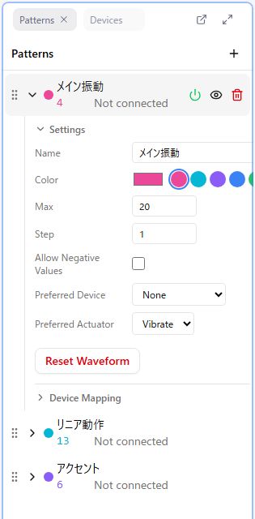

# Patterns

A control pattern is the data that defines the value changes sent to a device. You can create multiple patterns and assign each one to a different device.

## Basic Pattern Operations

### Adding a Pattern

1. Click the "+" button in the Patterns panel
2. A new pattern is created and selected automatically

A new pattern contains only 2 points: the start point (time = 0, value 0) and the end point (time = max time, value 0). Colors are assigned automatically in order from the default palette.

### Selecting a Pattern

- Click a pattern to make it the editing target (the active pattern)
- The selected pattern is highlighted
- Only the active pattern can be edited in the Curve Editor

### Opening Pattern Settings

- Click the "▶" to the left of the pattern name to expand the settings area
- Settings such as Name, Color, and Max, along with Device Mapping, are shown here

### Renaming a Pattern

- Type into the "Name" field in the settings area
- A name that tells you which body part and which kind of motion the pattern is for keeps patterns easy to manage as their number grows

### Reordering Patterns

- Drag the grip at the left edge of the row to reorder

### Deleting a Pattern

- Hover over the row and click the trash icon that appears

There is no confirmation dialog, but you can undo with Ctrl + Z.

## Show and Output Toggles

A pattern has two independent switches: **show** and **output**. They are easy to confuse, so take care.

| Icon | Meaning | Effect |
|------|---------|--------|
| Power | Device output on/off | When off, the pattern's values are no longer sent to the device (the icon glows green when on) |
| Eye | Display in the Curve Editor | When hidden, the pattern is no longer drawn on the canvas |

**Important**: Hiding a pattern with the eye icon does not stop output to the device. To silence a device, turn off the power icon.

- The power icon is always visible while output is off, and appears on hover while it is on
- The eye icon appears when you hover over the row

### Editing Restrictions for Hidden Patterns

A hidden pattern cannot be edited. Adding points, dragging, copying, cutting, pasting, deleting, generating waveforms, and equalizing points are all blocked with a message such as "Cannot add point while waveform is hidden".

### Showing Multiple Patterns at Once

- When several patterns are shown, they are drawn on top of each other in the Curve Editor
- Each pattern is distinguished by its assigned color
- Only the active pattern can be edited

## Pattern Settings

The following settings are available per pattern.

### Color

- Pick any color with the color picker
- Next to it are 8 presets (pink, cyan, violet, blue, green, yellow, orange, red) that apply instantly when clicked
- The color is reflected in the Curve Editor display
- Using a different color per role makes patterns easier to tell apart when several are shown

### Max (maxValue)

- Sets the upper limit of the pattern's values
- Default: 20 (the initial value for new patterns can be changed in Settings > Curve Editor > Default Max Value)
- Values sent to the device are normalized to 0% - 100%

**Example**: With a Max of 20

- Value 10 → sent to the device as 50%
- Value 20 → sent to the device as 100%

### Step (valueStep)

- Sets the increment used to quantize (snap) values
- Point values are aligned to this increment automatically

**Example**: With a Step of 5, values snap to 0, 5, 10, 15, 20...

### Allow Negative Values

- When enabled, the pattern's minimum value (minValue) becomes `-Max`, letting you use values below 0
- When disabled, the minimum value is 0
- Negative values are used for things like controlling the direction of rotation

The minimum value is also the lower bound of the Quick Point Bar. When negative values are allowed, the Quick Point Bar buttons start from the negative side.

### Preferred Device and Preferred Actuator

Two settings that express which body part and what kind of motion the pattern is meant for. **The combination of the two determines the pattern's effective device type.** They are used for automatic connection and for device assignment on the playback side.

**Preferred Device** (body part):

- Penis Device
- Anal Device
- Nipple Device
- Vaginal Device
- Clitoral Device
- None (excluded from automatic connection)

**Preferred Actuator** (kind of motion). Three types are available by default.

- **Vibrate**: Vibration
- **Rotate**: Rotation
- **Linear**: Linear motion (back-and-forth)

Enabling Settings > General > Experimental Mode adds Oscillate / Constrict / Inflate / Position / Spray / Temperature / LED.

**Example**: "Penis Device × Linear" means a piston-style motion, "Nipple Device × Rotate" means rotation aimed at the nipples — the combination is what gives the pattern its meaning.

**Note**: If any pattern has no Preferred Actuator set, saving the Remix fails with an error and no file is written. Always set it before saving.

### Reset Waveform

- Deletes every intermediate point in the pattern, keeping the start and end points
- A confirmation dialog is shown before it runs (you can undo with Ctrl + Z)

## Device Mapping

At the bottom of the pattern settings, the connected devices and their actuators are listed.

- **Auto**: Assign automatically based on the Preferred Device and Preferred Actuator
- **Manual**: Specify a particular actuator explicitly
- One pattern can also be assigned to several actuators
- Actuators already used by another pattern are greyed out

See [Devices](./05-devices.md) for details.

## Settings That Are Not Per-Pattern

The following two are **editor-wide settings** and cannot be set per pattern. Change them in Settings > Curve Editor.

- **Max Time**: The length of the whole timeline (seconds)
- **Time Step**: The minimum unit of the time axis (seconds)

The only increment you can set per pattern is the one on the value axis (Step).

## Current Value Display

Below the pattern name, the value at the current playback position and the assigned device information are always shown, so you can check how much intensity is being sent to the device. When there is no assignment, "Not connected" is shown.

## Number of Patterns

- The number of patterns you need depends on your device configuration
- One pattern per device is the basic approach, but the same pattern can also be sent to multiple devices
