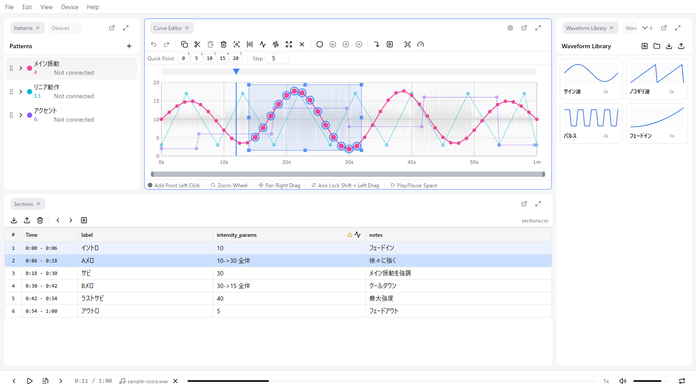

# Curve Editor

The Curve Editor is the main editing area of remix-editor. On a graph of time (horizontal axis) and value (vertical axis), you define value changes along the time axis with points.

A point holds only a "time (seconds)" and a "value". There are no point kinds or interpolation types: **every segment between points is interpolated as a straight line**.

## Panel Layout

The following elements are arranged from top to bottom (each can be shown or hidden in Settings > Curve Editor).

- **Toolbar**: Buttons for Undo/Redo, selection operations, pivots, the playhead, and the view
- **Quick Point Bar**: A row of value buttons at fixed intervals. Click, or press a number key, to add a point at the playback position
- **Canvas**: Grid, points, curve lines, the playhead (vertical line), the selection, pivots, and the background audio waveform
- **Viewport Slider**: A slider showing the position and width of the visible range
- **Hint Bar**: Hints for the main mouse operations

## Mouse Operations

| Operation | Action |
|-----------|--------|
| Left click (empty area) | Add a point. The new point is selected, so you can keep dragging to adjust its position |
| Left click (on a point) | Select the point. Ctrl + click / Shift + click adds to the selection |
| Left drag (on a point) | Move the point. Grabbing a point that is part of a multi-selection moves the whole selection |
| Shift + left drag | Select a time range (the full value range is included) |
| Ctrl + left drag | Rectangular selection |
| Right drag | Pan the viewport (this pans even over a point) |
| Wheel | Zoom around the cursor position |
| Right click | Context menu |
| Drag a selection handle | Resize the selection (see below) |
| Left click / drag in the playhead area | Seek. Pivots in that area can be dragged to move them |

Mouse bindings can also be changed in Settings > Shortcuts. For example, binding Zoom to a button lets you zoom by dragging horizontally, and binding Pan to the wheel lets you pan with the wheel.

## Point Operations

### Adding a Point

- **Left click** an empty area of the Curve Editor
- The added point is left selected, so you can drag without releasing to fine-tune its position

### Moving a Point

1. Drag the point
2. **Hold Shift** while dragging to lock the axis to whichever direction you moved first (time or value)

**Note**: The start point (time = 0) and the end point (time = max time) can only change their value; their time cannot be moved.

### Deleting a Point

1. Select the point
2. Press **Delete**

**Note**: The start and end points cannot be deleted.

### Editing Point Coordinates Numerically

When a point is selected, you can edit its "Time (sec)" and "Value" numerically in the **Properties** panel. See [Properties](./07-properties.md) for details.

### Quick Point Bar

The **Quick Point Bar** at the top of the Curve Editor lets you add points in a single action while playing.

- Buttons are laid out from the pattern's minimum value at a fixed **step** (default 5, changed with the number input at the right end of the bar), and the last button is always the maximum value
- Click a button, or press **number keys 1-9**, to add a point with that value at the **current playback position** and select it
- The number keys only work while the Curve Editor is active, and do nothing while a modifier key is held

It is designed for tapping along with the rhythm during playback. Show or hide the bar with Settings > Curve Editor > Show Quick Point Bar.

### Point Navigation

Shortcuts for stepping through the points you have created.

| Key | Action |
|-----|--------|
| Alt + → | Jump the playback position to the next point |
| Alt + ← | Jump the playback position to the previous point |
| N | Select the next point |
| B | Select the previous point |

## Selection Operations

### Range Selection

- **Shift + drag**: Select a time range (the full value range is included)
- **Ctrl + drag**: Select a rectangular range
- **Ctrl + A**: Select all points
- **Escape**: Clear the selection

### Moving Selected Points

Grab any of the selected points and drag to move all selected points together. Holding Shift locks the axis.

### Resizing the Selection

Drag a handle (edge or corner) of the selection to transform the points inside it.

| Handle | Action |
|--------|--------|
| Left / right edge | Move the start / end of the time range |
| Top / bottom edge | Shift the top / bottom value in parallel (the slope is preserved; this is not a proportional scale) |
| Corners | Move only that corner (trapezoid transformation) |
| Alt + edge | Symmetric resize where the opposite edge moves in the other direction |

While resizing, values are quantized to the Step, but time is not quantized.

### Zoom to Selection

1. Make a selection
2. Press the **Z** key

The viewport zooms to fit the selection.

### Equalize Points

1. Select a time range and select 2 or more points inside it
2. Press the **E** key (or use the toolbar or context menu)

The selected points are redistributed at equal intervals along the time axis within the selection. Use it when you want to line up the timing of hand-tapped points. The start point (time = 0) and the end point (time = max time) do not move.

## Viewport Operations

### Zoom In/Out

- Turn the **mouse wheel** (the cursor position is the anchor)
- Zoom sensitivity and direction inversion can be adjusted in Settings > Curve Editor

### Pan (Move)

- **Right-click and drag**
- You can also move with the viewport slider at the bottom of the Curve Editor

### Fit to View

- Select the "Fit to View" button in the toolbar, or "Fit to View" in the context menu

### Jump to Playback Position / Follow

- The **J** key moves the viewport to the current playback position. Useful when you lose track of the playback position while editing
- The **F** key (or the toolbar) toggles "Follow Playhead", which makes the viewport follow automatically during playback. Disabled by default; it can also be changed in **Settings > Playback > Follow Playhead**

## Pivots

A pivot is a marker you can place on the time axis. It is convenient for positions you want to return to repeatedly, such as the start of a chorus.

| Key | Action |
|-----|--------|
| P | Add a pivot at the current playback position |
| Shift + P | Jump to the next pivot (wraps to the first after the last one) |
| Ctrl + Shift + P | Jump to the previous pivot (wraps to the last before the first) |
| Ctrl + P | Align the playback position to the selected pivot |

- You can register **as many pivots as you like** (duplicates at nearly the same position (within ±0.001 sec) are ignored)
- Drag in the playhead area to move a pivot
- Delete them with the toolbar, or "Remove Pivot" / "Remove Pivots in Selection" in the context menu
- Pivots are auto-saved and are also stored in the Remix file. They are covered by Undo as well

## Velocity Coloring

A display mode that colors each segment of the curve from blue (slow) to red (fast) according to how quickly the value changes. It helps you find movements that are too abrupt for a device.

Toggle it with the speedometer icon in the toolbar. The normalization method can be chosen in Settings > Curve Editor.

| Mode | Basis |
|------|-------|
| Manual (default) | The velocity threshold you set (default 100 value/sec) |
| Auto | The maximum velocity within that pattern |
| Viewport | The maximum velocity in the visible range |

## Background Waveform Display

The audio waveform can be displayed in the Curve Editor background. Toggle it with **Settings > Curve Editor > Show Waveform Background** (enabled by default).

| Setting | Description | Default |
|---------|-------------|---------|
| Auto Scale Waveform | Automatically scale to the maximum value on screen | Enabled |
| Waveform Scale | Waveform height (%) | 50% |
| Waveform Sample Count | Waveform resolution (50 - 4000) | 2000 |

Increasing samples shows more detail but increases processing load.

## Clipboard Operations

| Key | Action |
|-----|--------|
| Ctrl + C | Copy the selected points |
| Ctrl + X | Cut the selected points |
| Ctrl + V | Paste relative to the **current playback position** |

Points are copied with relative times, so you can paste them at any other position as many times as you like. The clipboard is shared with the [Waveform Library](./10-waveform-library.md).

**Note**: If points already exist at the paste position, all except the start and end points are overwritten.

## Throttle Control

Feature to input values in real time during playback. It is operated from the dedicated "Throttle Control" panel. Use it when you want to build a curve with a live, hands-on feel.

In the default layout it is a tab in the same group as "Waveform Library". If you closed the panel, reopen it with **View > Panels > Throttle Control**.

### Usage

1. Select the active pattern
2. Start playback
3. Grab and drag the vertical slider

- One point is added at the current playback position the moment you grab the slider
- **Only during playback**, the dragged value is recorded continuously at time step intervals
- Values are treated as a ratio from 0 to 1 and recorded multiplied by the pattern's max value
- Releasing the drag groups the whole recording into a single Undo step

## Quantization

A feature that snaps points to a grid.

### Time Quantization

- Set in Settings > Curve Editor > Time Step (default 0.01 sec)
- It is a single setting shared by the whole editor

### Value Quantization

- Set with "Step" in the pattern settings
- It can be set per pattern

## Undo/Redo

Editing operations can be undone and redone.

- **Ctrl + Z**: Undo
- **Ctrl + Shift + Z**: Redo

History is managed as a single stack for the whole editor. Not only curve edits but also section edits and changes to Max Time and Time Step are pushed onto the same history.

## Context Menu

**Right-click** in the Curve Editor to show the context menu.

| Item | Function |
|------|----------|
| Copy / Cut / Paste / Delete | Clipboard operations |
| Generate Waveform | Open the [Waveform Generation](./09-waveform-generation.md) panel |
| Generate from Audio | Open the [Audio-Based Waveform Generation](./09-waveform-generation.md#audio-based-waveform-generation) panel |
| Save to Library | Save the selected waveform to the [Waveform Library](./10-waveform-library.md) |
| Equalize Points | Redistribute the selected points at equal intervals |
| Select All | Select all points |
| Zoom to Selection | Fill the screen with the selection |
| Fit to View | Return the view so that everything fits |
| Add Pivot / Remove Pivot / Remove Pivots in Selection | Pivot operations |
| Undo / Redo | Undo / Redo |

## Restrictions While a Pattern Is Hidden

If the active pattern is hidden (eye icon off), adding points, dragging, copying, cutting, pasting, deleting, generating waveforms, and equalizing points are all blocked with a message such as "Cannot add point while waveform is hidden". Make the pattern visible again before editing.
