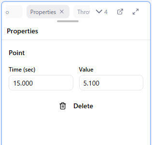

# Properties

The Properties panel lets you edit the coordinates of the points selected in the Curve Editor **numerically and precisely**. Use it for fine adjustments that are hard to get right by dragging.

## Editing a Single Point

When one point is selected, the following two input fields are shown.

| Item | Description |
|------|-------------|
| Time (sec) | The point's time position |
| Value | The point's value |

**Note**: The time of the start point (time = 0) and the end point (time = max time) cannot be changed. Only their value can be edited.

## With Multiple Points Selected

With multiple points selected, the number of selected points and the time range are shown, and you can delete them all at once (the start and end points are not deleted).

## Showing the Panel

If the Properties panel is not visible, show it with **View > Panels > Properties**.

## Related Pages

- [Curve Editor](./06-curve-editor.md) - Selecting points and editing with the mouse
