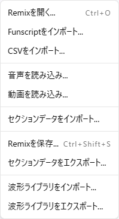

# File Operations

remix-editor supports multiple file formats.

## Import

### Remix JSON

remix-editor's standard format.

**File format**: `.remix.json`

**Included data**:
- All control patterns
- Pattern settings
- Point data

**Import steps**:
1. Select **File > Import**
2. Or drag and drop file
3. Confirm settings in import dialog
4. Click "Import"

**Options**:
- **Keep existing patterns**: Maintain existing patterns and merge
- **Import as normalized data**: Change value interpretation

### Funscript

Widely used format for The Handy, etc.

**File format**: `.funscript`

**Conversion**:
- Time: milliseconds → seconds
- Value: 0-100 → 0-maxValue

**Options**:
- **Invert**: Invert values on import

### CSV (Control Pattern)

Import patterns from generic CSV files.

**Detailed options**:

| Option | Description |
|--------|-------------|
| Data Direction | Vertical (columns) / Horizontal (rows) |
| Time Index | Column/row number containing time |
| Value Index | Column/row number containing values |
| Sign Index | Column/row number containing sign (optional) |
| Sign Format | +/-, 1/-1, 0/1, etc. |
| Time Unit | Seconds/milliseconds/deciseconds/centiseconds/minutes |
| Value Extension | Hold value until next point |
| Source Max Value | Max value for mapping |

### Section CSV

Import section data.

See [Sections](./05-sections.md) for details.

### Drag and Drop

Dragging and dropping a file onto the application opens the appropriate import dialog based on file format.

| Extension | Processing |
|-----------|------------|
| .remix.json | Remix JSON import |
| .funscript | Funscript import |
| .csv | CSV import dialog |
| .mp3, .wav, etc. | Audio file load |

## Export

### Remix JSON

Export in remix-editor's standard format.

**Steps**:
1. Select **File > Save Remix...**
2. Specify location in file save dialog
3. Save

**Filename format**: `{audio filename}.{ISO8601 timestamp}.remix.json`

**Example**: `sample_audio.2026-01-15T10-30-00.remix.json`

**Included data**:
- All control patterns
- Pattern settings (including preferredActuatorType)
- All point data

### Section CSV

Export section data as CSV.

**Steps**:
1. Select **File > Export Section CSV**
2. Specify location in file save dialog
3. Save

**Filename format**: `{audio filename}.{ISO8601 timestamp}.sections.csv`

**Format**: RFC 4180 compliant (proper escaping)

## Auto-Save

### Auto-Save of Work Data

remix-editor automatically saves the following data in the browser:

| Data | Storage |
|------|---------|
| Control patterns | LocalStorage |
| Audio files | IndexedDB |
| Settings | LocalStorage |
| Section data | LocalStorage |

### Restore

Saved data is automatically restored on next launch.

## Cache Management

### Clear Work Data

Delete all work data and return to initial state.

**Steps**:
1. Open **Settings > Advanced Settings**
2. Click "Clear Work Data"
3. Select "Clear" in confirmation dialog

**Deleted data**:
- All LocalStorage data
- All IndexedDB data

**Note**: This operation cannot be undone. Export necessary data beforehand.

## v1 File Compatibility

### Legacy Format Support

Files created with remix-editor v1 can also be loaded.

| v1 Format | v2 Handling |
|-----------|-------------|
| `{x, y}` format | Auto-convert to `{time, value}` |
| Normalized values | Convert to actual values |

### Conversion Notes

- Saving a v1 file in v2 converts it to v2 format
- Cannot revert to v1 format

## Backup Recommendations

### Regular Export

We recommend regularly exporting important work.

- Browser data may be cleared
- Convenient for continuing work on different PCs

### When to Export

- After completing major edits
- Before stopping work
- Before sharing
