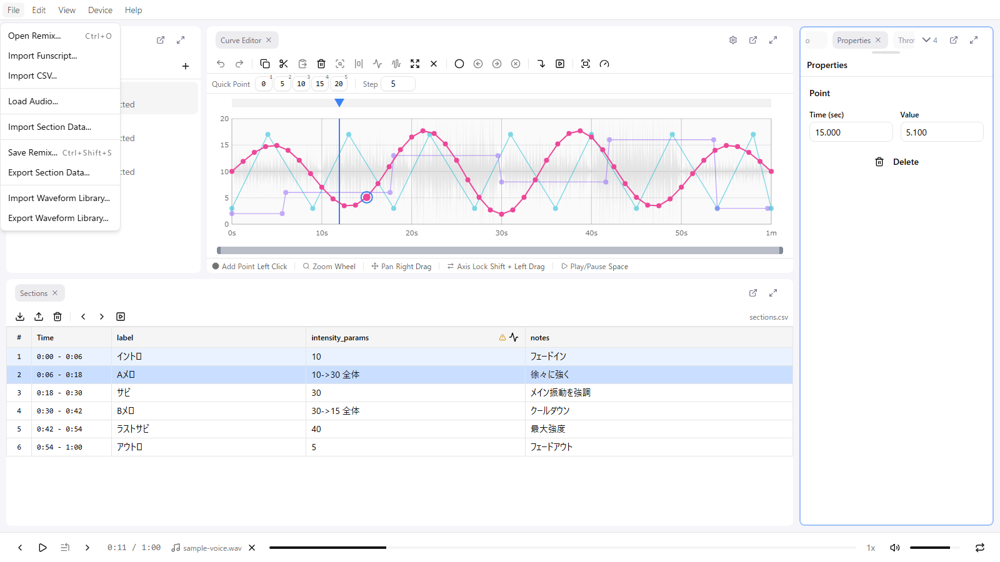

# File Operations

remix-editor supports multiple file formats.

## File Menu

| Item | Shortcut | Description |
|------|----------|-------------|
| Open Remix... | Ctrl + O | Load `.json` / `.remix` |
| Import Funscript... | - | Load `.funscript` |
| Import CSV... | - | Load patterns from a generic CSV |
| Load Audio... | - | Load an audio file |
| Import Section Data... | - | Load a section CSV |
| Save Remix... | Ctrl + Shift + S | Download as `.remix.json` |
| Export Section Data... | - | Download a section CSV |
| Import Waveform Library... | - | Load `.wavelib.json` |
| Export Waveform Library... | - | Download the waveform library |

"Save" means a browser download. It does not update a document on the server (except for [Backend Integration](#backend-integration)).

## Import

### Remix JSON

remix-editor's standard format.

**File format**: `.remix.json` (the file picker accepts `.json` / `.remix`)

**Included data**:
- All control patterns
- Pattern settings
- Point data
- Pivots

**Import steps**:
1. Select **File > Open Remix...**
2. Or drag and drop the file
3. Confirm settings in the import dialog
4. Click "Import"

**Dialog contents**:

| Item | Description |
|------|-------------|
| Detected patterns | Number of patterns contained in the file |
| Pattern list | The name of each pattern can be edited (with a color chip) |
| Keep existing patterns and merge | When on, existing patterns are kept and merged |

### Funscript

Widely used format for The Handy, etc.

**File format**: `.funscript`

**Conversion**:
- Time: milliseconds → seconds
- Value: 0-100 → 0-editor max value

**Dialog contents**:

| Item | Description |
|------|-------------|
| Funscript range / Actions | Information about the loaded file (display only) |
| Target pattern | Create a new pattern, or select an existing one |
| Editor max value | Default 20 (1 - 1000) |
| Value step | Default 1 (0.1 - 10) |
| Invert values | Swaps the max and min values on import |

### CSV (Control Pattern)

Import patterns from generic CSV files. A two-pane preview shows the raw data and the converted result while you configure the settings. Settings are carried over to the next import.

**Data Settings**:

| Option | Description |
|--------|-------------|
| Data Direction | Vertical (column-wise) / Horizontal (row-wise) |
| Time Data | The column/row containing time |
| Value Data | The column/row containing values |
| Time Unit | Seconds / Milliseconds / Deciseconds / Centiseconds / Minutes |

**Value Settings**:

| Option | Description |
|--------|-------------|
| Target Pattern | Create a new pattern, or select an existing one |
| Source Max Value | The scale to map from |
| Editor Max Value | The scale to map to |
| Value Step | The quantization unit |
| Extend values to next point | Holds the value in a stepped shape |
| Import as normalized data (0-1 range) | Interprets the source data as normalized 0-1 values |

**Sign Settings**:

| Option | Description |
|--------|-------------|
| Get sign from separate column/row | When on, you can specify the column/row holding the sign data |
| Sign Format | `+/-`, `1/-1`, `0/1`, `positive/negative`, `plus/minus`, `P/N`, `pos/neg`, etc. |

The bottom of the dialog shows how many points will be generated ("N points will be generated").

### Section CSV

Import section data.

See [Sections](./05-sections.md) for details.

### Waveform Library

The library of saved waveform snippets can be exchanged as a file.

- **File > Import Waveform Library...** (`.wavelib.json` / `.json`)
- **File > Export Waveform Library...** (downloads as `waveform-library.wavelib.json`)

The same operations are available from the Waveform Library panel menu.

### Drag and Drop

Dragging and dropping a file anywhere on the application detects the file format and opens the appropriate import dialog.

| Extension | Processing |
|-----------|------------|
| .remix.json / .json / .remix | Remix JSON import |
| .funscript | Funscript import |
| .csv | CSV import dialog |
| .mp3, .wav, etc. | Audio file load |

## Export

### Remix JSON

Export in remix-editor's standard format.

**Steps**:
1. Select **File > Save Remix...** (Ctrl + Shift + S)
2. It is saved as a browser download

**Filename format**: `{audio filename}.{ISO8601 timestamp}.remix.json`

**Example**: `sample_audio.2026-07-28T10-30-00.remix.json`

When no audio is loaded, the filename becomes `untitled.{timestamp}.remix.json`.

**Included data**:
- All control patterns
- Pattern settings (including Preferred Actuator)
- All point data
- Pivots

**When export is not possible**:

| Situation | Message shown |
|-----------|---------------|
| No patterns at all | エクスポートするパターンがありません (There are no patterns to export) |
| A pattern has no Preferred Actuator set | 優先アクチュエータータイプが未設定のパターンがあります: {pattern name} (Some patterns have no preferred actuator type set) |

> These export error messages are hardcoded and **appear in Japanese regardless of the language setting**.

In these cases no download occurs. Set Preferred Actuator in the pattern settings and run the export again.

### Section CSV

Export section data as CSV.

**Steps**:
1. Select **File > Export Section Data...** (also available from the section table toolbar)
2. It is saved as a browser download

**Filename format**:

| Situation | Filename |
|-----------|----------|
| Normal | `sections-{YYYY-MM-DD}.csv` |
| When work metadata exists | `{circle name}-{3-digit work number}-{3-digit chapter number}.{YYYY-MM-DD}.csv` |

Gap sections are not exported.

**Format**: RFC 4180 compliant (proper escaping)

## Auto-Save

### Auto-Save of Work Data

remix-editor has no concept of "saving a document" — edits are always auto-saved to the browser.

| Data | Storage | Key |
|------|---------|-----|
| Control patterns | LocalStorage | `editor-patterns` |
| Section data | LocalStorage | `editor-sections` |
| Settings | LocalStorage | `editor-settings` |
| Playback state / pivots | LocalStorage | `editor-audio` |
| Viewport | LocalStorage | `editor-viewport` |
| Panel layout | LocalStorage | `remix-editor-layout` / `remix-editor-layout-locked` |
| Audio files | IndexedDB | - |

### Restore

Saved data is automatically restored on next launch.

Audio files larger than **Settings > General > Audio Cache Limit** (default 50MB) are not stored. See [Playback](./07-playback.md) for details.

## Data Management

### Clear Work Data

Data can be deleted per category from **Settings > General > Data Management**.

| Category | What is deleted |
|----------|-----------------|
| Waveform Data | Created waveform patterns |
| Audio Data | Loaded audio files |
| Section Data | Sections imported from CSV |
| Settings | Editor settings, viewport, presets |
| All Data | All of the above |

**Steps**:
1. Open **Settings > General**
2. Click "Clear" for the relevant category under "Data Management"
3. Execute in the confirmation dialog

**Note**: This operation cannot be undone. The page reloads automatically after clearing. Export necessary data beforehand.

## Backend Integration

When remix-editor is opened with a URL issued from the CMS or similar (`?token=...&workId=...&chapterId=...`), audio, section data, and Remix data are loaded automatically from the backend. After loading, the parameters are removed from the URL.

Only when the token permissions and the parameter conditions are satisfied, a floating "Save" button — which can be dragged around the screen — appears, allowing the edits to be saved to the backend (Save / Saving... / Saved / Failed to save).

When opened without a token, the editor runs in fully local mode and no backend-related UI is shown at all. There is no login feature.

## v1 File Compatibility

### Legacy Format Support

Files created with remix-editor v1 can also be loaded.

| v1 Format | v2 Handling |
|-----------|-------------|
| `{x, y}` format | Auto-convert to `{time, value}` |
| Normalized values | Convert to actual values |

### Conversion Notes

- Saving a v1 file in v2 converts it to v2 format
- Cannot revert to v1 format

## Backup Recommendations

### Regular Export

We recommend regularly exporting important work.

- Browser data may be cleared
- Convenient for continuing work on a different PC

### When to Export

- After completing major edits
- Before stopping work
- Before sharing

## Troubleshooting

### Import Fails

1. Confirm the file format is correct
2. Confirm the file is not corrupted
3. Try another file

### Cannot Export

Export is blocked while any pattern has no Preferred Actuator set. Set Preferred Actuator in the pattern settings.

### Exported File Won't Open

1. Confirm the file extension is correct
2. Check the contents in a text editor
3. Check for JSON syntax errors

### Data Not Restored

1. Confirm LocalStorage is enabled in the browser settings
2. Confirm you are not in private browsing mode
3. Confirm the browser data has not been cleared
4. If only the audio disappears, check the audio cache limit
