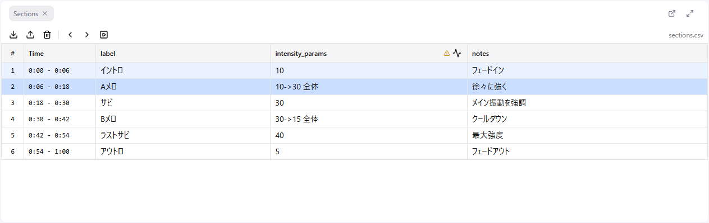

# Section Data

Section data is information attached to each interval (start time to end time) of the audio. It can hold arbitrary attributes such as a transcript or notes.

The primary use is **viewing**.

- **Checking the transcript**: Edit while checking, in a table, what is being said where in the audio
- **Notes**: Write down remarks and intent for each interval
- **Navigation**: Click a row to jump straight to that scene

## Importing Sections

### CSV File Format

A section CSV requires the following columns:

| Column | Required | Description |
|--------|----------|-------------|
| start_time | Yes | Section start time (seconds) |
| end_time | Yes | Section end time (seconds) |
| (others) | No | Any attribute columns (transcript, notes, intensity, etc.) |

**CSV example**:
```csv
start_time,end_time,intensity_params,note
0,10,5,Intro
10,30,10,Chorus
30,45,15,Climax
45,60,5,Outro
```

**Note**: The `_params` suffix in column names is used by [Generating Waveforms from Sections](./09-waveform-generation.md#generating-waveforms-from-sections).

### How to Import

1. Select **File > Import Section Data...**
2. Select the CSV file

You can also import from the toolbar of the Sections panel. Dragging and dropping the CSV file onto the app also imports it.

## Sections Panel



Imported sections are displayed as a table.

### What Happens When You Click a Row

Clicking a row does two things at once.

1. The Curve Editor selection is set to that section's time range
2. The playback position moves to the section's start time

When you want to fix the curve for a particular scene, a single click on the row both selects the target range and cues it up.

Use **Shift + click** to select several sections at once. The number of selected sections is shown as a badge in the toolbar.

### Toolbar

| Button | Function |
|--------|----------|
| Import | Load a section CSV |
| Export | Write the current sections out to CSV |
| Clear | Delete all sections |
| ◀ / ▶ | Move to the previous / next section (the playback position moves as well) |
| Auto-scroll | Make the table scroll automatically to follow the playback position |

At the right end, the number of selected sections and the filename of the loaded CSV are shown.

If you enable **Auto-scroll** while playing, the row for the scene currently playing is always kept in view. This is convenient for reviewing while following the transcript with your eyes.

### Editing Cells

Cell contents, such as adding to a note, can be edited directly in the table.

1. Click a cell to enter edit mode
2. Enter a value
3. **Escape** cancels; clicking outside the cell saves automatically

The key that confirms the edit depends on the column type.

| Column type | Confirm | Line break |
|-------------|---------|------------|
| Single-line text | Enter | — |
| Multi-line text | Ctrl + Enter or Shift + Enter | Enter |

Cells in `_params` columns have a slider that lets you adjust the intensity intuitively.

## Section Navigation

You can move between sections with the keyboard.

| Key | Action |
|-----|--------|
| ← | Move to the previous section |
| → | Move to the next section |
| Shift + ← | Extend the selection to the previous section |
| Shift + → | Extend the selection to the next section |

**Note**: Keyboard navigation only changes which section is selected; **the playback position does not move**. If you want the playback position to move as well, click a row or use the ◀ ▶ buttons in the toolbar or footer.

When sections are loaded, the buttons at both ends of the footer transport also become "move to the previous / next section" buttons.

## Gap Sections

When there is empty space between sections, a "gap section" is generated automatically.

- Display: grey background, value shown as "-"
- Editing: not allowed
- Navigation: included as a target for movement

**Note**: In waveform generation, a gap section **inherits the value of the preceding section** (for a range value, it inherits the end value). It is displayed as "-", but that does not mean the value is 0.

## Exporting Sections

You can save the edited section data as CSV.

1. Select **File > Export Section Data...** (also available from the Sections panel toolbar)
2. The file is downloaded

The filename has one of the following formats.

- Normal: `{audio filename}.{timestamp}.sections.csv`
- When opened with work information: `{circle name}-{work number}-{chapter number}.{date}.csv`
