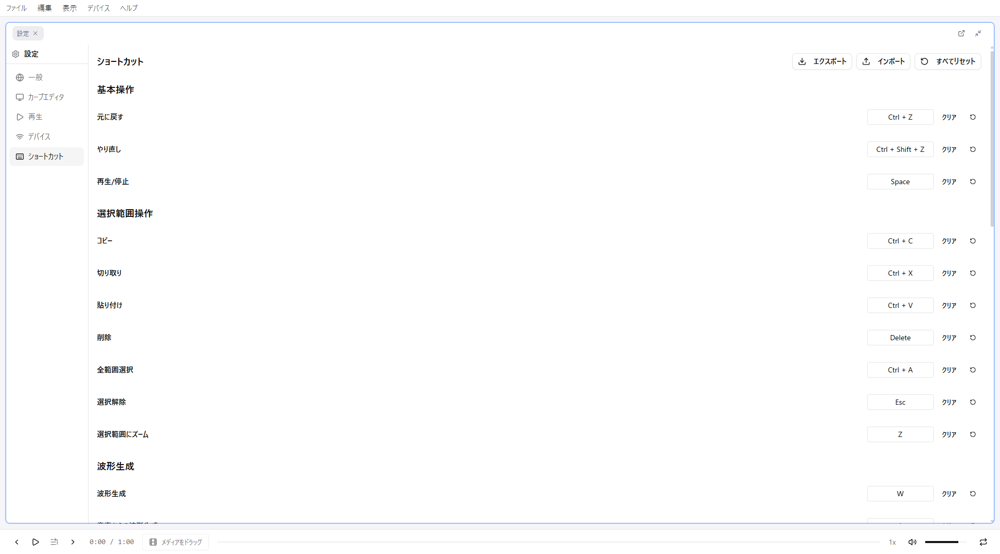

# Shortcuts

Keyboard shortcuts for remix-editor.

## Basic Operations

| Key | Function |
|-----|----------|
| Ctrl + Z | Undo |
| Ctrl + Y | Redo |
| Ctrl + Shift + Z | Redo |
| Space | Play/Pause |

## File Operations

| Key | Function |
|-----|----------|
| Ctrl + O | Import |
| Ctrl + Shift + S | Export |

## Editing Operations

| Key | Function |
|-----|----------|
| Ctrl + C | Copy |
| Ctrl + X | Cut |
| Ctrl + V | Paste |
| Delete | Delete |
| Backspace | Delete |
| Ctrl + A | Select All |
| Escape | Deselect |

## View Operations

| Key | Function |
|-----|----------|
| Z | Zoom to Selection |
| J | Jump to Playback Position |

## Waveform Generation

| Key | Function |
|-----|----------|
| W | Open Waveform Generator |
| A | Waveform from Audio |

## Pivot

| Key | Function |
|-----|----------|
| P | Set/Clear Pivot |
| Shift + P | Jump to Pivot |
| Ctrl + P | Move Playback to Pivot |

## Playback Speed

| Key | Function |
|-----|----------|
| Shift + > | Increase Speed |
| Shift + < | Decrease Speed |

## Section Navigation

| Key | Function |
|-----|----------|
| Left Arrow | Previous Section |
| Right Arrow | Next Section |
| Shift + Left Arrow | Also Select Previous |
| Shift + Right Arrow | Also Select Next |

## Mouse Operations

| Operation | Function |
|-----------|----------|
| Left Click (empty) | Add Point |
| Left Click (on point) | Select Point |
| Left Drag | Move Point |
| Shift + Left Drag | Range Selection (Time Range) |
| Ctrl + Left Drag | Rectangle Selection |
| Right Drag | Pan Viewport |
| Mouse Wheel | Zoom In/Out |
| Drag within Selection | Move Selected Points |
| Drag Handle | Resize Selection |
| Alt + Drag Handle | Symmetric Resize |
| Drag Playhead Area | Change Playback Position |

## Selection Resize Details

| Handle | Action |
|--------|--------|
| Left/Right Edges | Scale in Time Direction |
| Top/Bottom Edges | Proportional Scale in Value Direction |
| Corners | Tilted Scale (Trapezoid Transformation) |
| Alt + Top/Bottom | Scale from Center |
| Alt + Corners | Simultaneous Adjustment of Opposite Side (Symmetric) |

## Shortcut Customization

Shortcuts can be customized from the settings screen.

### Open Settings

1. Open **Settings**
2. Select **Shortcuts** tab

### Change Key

1. Click "Change" button for the item to modify
2. Press new key
3. Click "Save"

### Reset to Default

Reset to initial settings with each item's "Reset" button, or "Reset All to Default".

### Export/Import Settings

Save and load shortcut settings as JSON file.

1. "Export" to save to file
2. "Import" to load from file

Useful for migrating settings to different environments.

## Notes

### While Input is Focused

During text input (pattern name editing, section editing, etc.), global shortcuts are disabled.

**Exception**: Escape key exits input and returns to normal mode.

### While Modal is Open

While a modal dialog is open, global shortcuts except Escape are disabled.

- **Escape**: Close modal

### Browser Conflicts

Some shortcuts may conflict with browser functions.

| Key | Browser Function | remix-editor Behavior |
|-----|------------------|----------------------|
| Ctrl + S | Save Page | Disabled (use Export) |
| Ctrl + P | Print | Assigned to Pivot function |
| F5 | Refresh Page | Works normally |

**Tip**: Even if you accidentally refresh the page, auto-saved data is restored.
