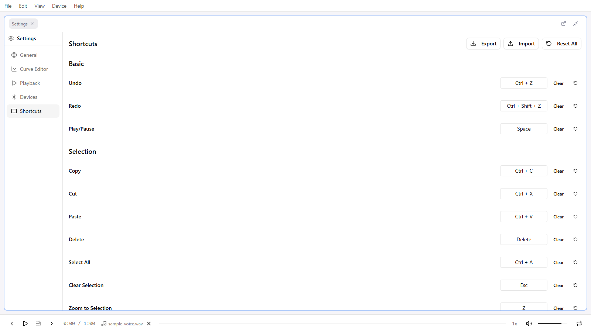

# Shortcuts

Keyboard shortcuts for remix-editor. The assignments listed here are the **defaults**, and almost all of them can be changed from the settings screen.

> **Shortcuts marked with ※ only work while the Curve Editor panel is active.** Click the panel tab or its contents to activate it before using them.

## Basic Operations

| Key | Function |
|-----|----------|
| Ctrl + Z | Undo |
| Ctrl + Shift + Z | Redo |
| Space | Play/Pause |

## Application

| Key | Function |
|-----|----------|
| Ctrl + O | Import (Open Remix) |
| Ctrl + Shift + S | Export (Save Remix) |
| Ctrl + , | Open Settings |

## Selection ※

| Key | Function |
|-----|----------|
| Ctrl + C | Copy |
| Ctrl + X | Cut |
| Ctrl + V | Paste |
| Delete | Delete |
| Ctrl + A | Select All |
| Escape | Clear Selection |
| Z | Zoom to Selection |
| E | Equalize Points |

## Waveform Generation ※

| Key | Function |
|-----|----------|
| W | Generate Waveform |
| A | Generate from Audio |

## Playback

| Key | Function | Note |
|-----|----------|------|
| J | Jump to Playhead | ※ |
| F | Toggle Follow Mode | ※ |
| P | Set Pivot (adds one) | |
| Shift + P | Jump to Next Pivot | |
| Ctrl + Shift + P | Jump to Previous Pivot | |
| Ctrl + P | Align Playhead to Pivot | |
| Alt + → | Jump to Next Point | |
| Alt + ← | Jump to Previous Point | |
| N | Select Next Point | |
| B | Select Previous Point | |
| Shift + > | Increase Speed | |
| Shift + < | Decrease Speed | |

Multiple pivots can be registered, and Shift + P / Ctrl + Shift + P cycle through them in registration order.

## Section Navigation

| Key | Function |
|-----|----------|
| ← | Previous Section |
| → | Next Section |
| Shift + ← | Extend to Previous Section |
| Shift + → | Extend to Next Section |

Section navigation by keyboard only moves the selected index; the playback position and the selection do not change. To move the playback position as well, click a row in the section table or use the toolbar buttons.

## Quick Point ※

| Key | Function |
|-----|----------|
| 1 - 9 | Add a point at the value of the nth button from the left in the quick point bar |

- Only available while the quick point bar is shown (**Settings > Editor > Show Quick Point Bar**)
- Disabled while Ctrl / Shift / Alt is held
- These keys are fixed and cannot be changed from the settings screen

## Mouse Operations

| Operation | Function |
|-----------|----------|
| Left Click (empty) | Add Point (drag straight away to move it) |
| Left Click (on point) | Select Point (Ctrl / Shift + Click to add to the selection) |
| Left Drag (on point) | Move Point (moves all selected points together) |
| Shift + Left Drag | Range Select (time range; the full value range is covered) |
| Ctrl + Left Drag | Rect Select |
| Right Drag | Pan |
| Mouse Wheel | Zoom centered on the cursor |
| Right Click | Context Menu |
| Drag Handle | Resize Selection |
| Left Click / Drag in playhead area | Change playback position (pivots in the area can be dragged to move them) |

Right drag pans even when the cursor is over a point. Wheel zoom sensitivity, pan sensitivity, and direction inversion can be adjusted in **Settings > Editor**.

## Selection Resize Details

| Handle | Action |
|--------|--------|
| Left/Right Edges | Move the start/end of the time range |
| Top/Bottom Edges | Shift the top/bottom value in parallel (the slope is preserved; it is not a proportional scale) |
| Corners | Move only that corner (trapezoid transformation) |
| Alt + Edge | Symmetric resize where the opposite side moves in the opposite direction |

Only values changed by the resize are quantized; time is not quantized. Note that **Alt + Corners currently has no effect**.

## Shortcut Customization

Shortcuts can be customized from the settings screen.

### Open Settings

1. Open **Settings** (Ctrl + ,)
2. Select the **Shortcuts** category

They are grouped into the categories Basic / Selection / Waveform / Playback / Section / Application / Mouse.

### Change Key

1. Click the input field of the item to change (it changes to "Press a key...")
2. Press the new key combination

A warning is shown if the assignment duplicates another shortcut. "Clear" removes the assignment.

### Change Mouse Operations

Add Point, Zoom, Pan, Range Select, Rect Select, and Context Menu can have their button (left/right/middle) and modifier keys changed. Zoom and Pan can also be assigned to the wheel, so configurations such as "wheel to pan, drag to zoom" are possible.

### Reset to Default

The "Reset All" button restores every shortcut to its initial setting.

### Export/Import Settings

Save and load shortcut settings as a JSON file.

1. "Export" to save to a file
2. "Import" to load from a file

Useful for migrating settings to a different environment.

## Notes

### While Input is Focused

During text input (pattern name editing, section editing, etc.), global shortcuts are disabled.

**Exception**: Escape key exits input and returns to normal mode.

### Panel Active State

Shortcuts marked with ※ only work while the Curve Editor panel is active. Right after operating another panel such as the section table, click the curve editor before using them.

Play/Pause, Undo/Redo, Import/Export, Settings, section navigation, pivots, and point navigation work no matter which panel is active.

### While Modal is Open

While a modal dialog is open, global shortcuts except Escape are disabled.

- **Escape**: Close modal

### Browser Conflicts

Some shortcuts may conflict with browser functions.

| Key | Browser Function | remix-editor Behavior |
|-----|------------------|----------------------|
| Ctrl + O | Open File | Assigned to Open Remix |
| Ctrl + P | Print | Assigned to the pivot function |
| F5 | Refresh Page | Works normally |

**Tip**: Even if you accidentally refresh the page, auto-saved data is restored.
