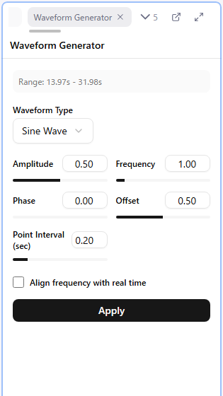

# Waveform Generation

Generates waveforms such as triangle waves across the selected time range in one go.

There are 2 generation methods.

| Method | Source | Description |
|--------|--------|-------------|
| [Waveform Generator Panel](#waveform-generator-panel) | Waveform type and parameters | Procedurally generate sine, triangle, and other waves |
| [Audio-Based Waveform Generation](#audio-based-waveform-generation) | Audio volume | Convert volume changes into a waveform |

## Waveform Generator Panel



### Steps

1. **Select a time range** (Shift + drag, or select 2 or more points)
2. Press the **W** key (or right-click > Generate Waveform) to open the Waveform Generator panel
3. Press the panel's "Generate Waveform" button to start the **preview**
4. Changing a parameter updates the preview on the canvas in real time
5. Press "Apply" to commit when you are satisfied ("Cancel" discards the preview)

**Note**: Generation is not possible unless a time range is selected.

### Waveform Types and Parameters

| Type | Type-specific parameters |
|------|--------------------------|
| Sine Wave | Point Interval (0.05-1 sec) |
| Triangle Wave | Peak Position (0.01-0.99) |
| Triangle (Slope) | Min Value / Max Value / Slope (0.1-20 unit/sec) |
| Square Wave | None |
| Random Wave | Point Interval (0.05-1 sec) |

The common parameters are as follows.

| Parameter | Description |
|-----------|-------------|
| Amplitude | Height of the wave |
| Frequency | Density of the wave (0.1-10) |
| Phase | Offset of the wave's start position |
| Offset | Vertical position of the whole wave (0-1) |

**Triangle (Slope)** works differently from the other types: instead of a frequency, you specify the speed of the wave as a slope, "how many units it moves per second". It is convenient when you want to match a device's tracking speed.

### Align Frequency with Real Time

When checked, frequency is treated as "waves per second" instead of "waves within the selection".

### Behavior on Apply

- Existing points inside the range are deleted (the endpoints at time = 0 and max time remain)
- Generated values are quantized to the Step and clamped to the min/max value range
- Points that are too close in time to an existing point (within half of the time step) are skipped
- The whole apply is grouped as a single Undo step
- After applying, the generated points are selected

## Audio-Based Waveform Generation

You can automatically generate a waveform by analyzing audio volume.

### Steps

1. Select a time range
2. Press the **A** key (or right-click > Generate from Audio) to open the panel
3. Press the "Generate Waveform" button to start the preview and adjust the parameters
4. Press "Apply" to commit

If no audio is loaded, the generate button is disabled.

### Parameters

| Parameter | Description |
|-----------|-------------|
| Threshold | Specified from 0 to 1. It is a ratio against the maximum volume; volume below it becomes value 0 |
| Point Interval | Specified as a **multiple of the time step** (an integer from 1 to 20). E.g. time step 0.1 sec x 20 = every 2 seconds |

### Using a Different Audio File

With "Select audio file" you can analyze a file other than the audio you currently have loaded. This lets you do things like analyzing only a sound-effects track to build a vibration pattern.

## Device-Specific Waveform Tips

### Linear Devices (A10 Piston, The Handy, etc.)

- **Use simple waveforms**: Up-and-down motion such as a triangle wave is the basis
- **Avoid complex shapes**: Complex waveforms make device movement jerky
- **Rest position**: The initial and rest positions are best at the top (value = max value)

### Vibration Devices (Anal plugs, etc.)

- **Rest position**: The initial and rest positions are best at the bottom (value = 0)
- **Triangle / sine waves**: Use them to express piston-like motion

### Rotation Devices (Nipple machines, etc.)

- **Allow negative values**: Enable "Allow Negative Values" to switch the direction of rotation
- **Positive = clockwise, negative = counter-clockwise**
- **Separate left/right control**: Setting different waveforms for left and right increases immersion

## Generating Waveforms from Sections

There is also a feature that generates a waveform in one go from the values in the `_params` columns of sections. It is not used in normal production; it is documented here for reference.

### Columns That Support Waveform Generation

**Important**: Waveform generation is only available for columns whose names end with `_params`.

**Examples**:
- `intensity_params` ✓ Waveform generation possible
- `speed_params` ✓ Waveform generation possible
- `intensity` ✗ Not possible (treated as a text column)
- `note` ✗ Not possible

When you create your CSV, be sure to add the `_params` suffix to any column you want to use for waveform generation.

### Opening the Generation Dialog

- Click the waveform icon in the column header in the Sections panel

A warning icon is shown in the header of any `_params` column that has no preset set.

### Settings in the Dialog

| Item | Description |
|------|-------------|
| Target Column | Which `_params` column's values to use |
| Target Sections | "All" or "Selected Only" |
| Preset | Save and recall a whole set of settings |
| Text Rules | How to interpret the text attached to a value |
| Waveform Type | Linear / Triangle |
| Advanced Options | Grouping, phase continuity, point optimization |

### Waveform Types

#### Linear

Expresses the section's intensity value directly as a straight line.

- Single value: generates a flat line
- Range value: generates a sloped line

#### Triangle

Generates a triangle wave based on the section's intensity value. You can limit the speed of the wave with "Triangle Slope Settings".

- **Min Slope (unit/sec)**: Never use a slope gentler than this
- **Max Slope (unit/sec)**: Never use a slope steeper than this

Use it when you want to avoid abrupt changes a device cannot follow.

### Text Rules

Configure how the text attached to a `_params` value is interpreted. Add as many rules as you need, each in the form "if this text, then do this".

| Rule | Description |
|------|-------------|
| Value Range | Specify the operating range (min and max) for that text |
| Sign | Specify whether the value is output in the positive or negative direction |
| Waveform On/Off | Generate or ignore the waveform for that text |

### Presets

You can save a whole set of settings, including text rules, as a preset.

- **Save**: Save under a name
- **Delete**: Delete the selected preset
- **Export / Import**: Exchange presets as files

Presets are remembered per column, so you can use different ones for different columns, e.g. preset A for the `intensity_params` column and preset B for the `speed_params` column.

### Advanced Options

| Option | Effect |
|--------|--------|
| Grouping | Treat consecutive sections with the same settings and intensity as one unit |
| Phase Continuity | Continue the wave phase within a group so the waveform does not break at the boundaries |
| Point Optimization | Reduce meaningless intermediate points to keep the output light |

Groups are split by gap sections, and the phase is reset between groups.

### Parameter Format

This section explains the format of values entered in a `_params` column.

#### Basic Format

```
{intensity 0-100}{text}
```

**Examples**:
- `30` - intensity 30
- `30全体` - intensity 30, text "全体"

The intensity is clamped to the range 0-100 and normalized to 0-1 internally. If you write only text, the intensity is treated as 0.

#### Changing Values

```
{start value}->{end value}{text}
```

**Examples**:
- `10->30` - intensity changes from 10 to 30
- `0->50全体` - intensity changes from 0 to 50, text "全体"

#### What the Text Is For

The text portion is used in combination with "Text Rules". For example, by creating a rule for a linear device such as "for this text, limit the operating range to 70-100%", or one for a rotation device such as "for this text, output in the negative direction (reverse rotation)", you can shape different motions just by writing the section table.
