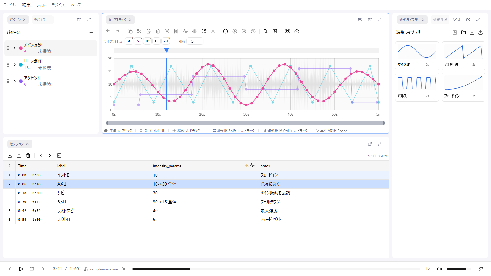
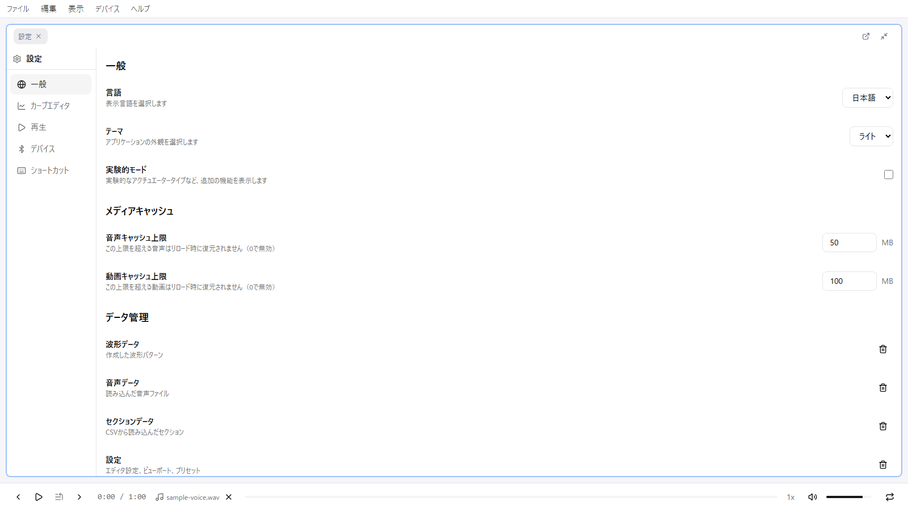

# 表示とレイアウト

remix-editor の画面は複数のパネルで構成されています。各パネルはドラッグで移動・リサイズ・タブ化が可能で、用途に合わせてレイアウトを自由に組み替えられます。

## 全体レイアウト

画面は上から順に 3 つのエリアで構成されています。

| エリア | 内容 |
|--------|------|
| 上部 | メニューバー |
| 中央 | パネルエリア（自由に配置できる複数のパネル） |
| 下部 | 再生フッター |

## メニューバー

メニューは 5 つあります。

| メニュー | 主な項目 |
|----------|----------|
| ファイル | Remixを開く / Funscriptをインポート / CSVをインポート / 音声を読み込み / セクションデータをインポート / Remixを保存 / セクションデータをエクスポート / 波形ライブラリをインポート・エクスポート |
| 編集 | 元に戻す / やり直し / 設定（Ctrl + ,） |
| 表示 | レイアウト ▸（プリセット・ロック・リセット）/ パネル ▸（各パネルの表示切り替え） |
| デバイス | 接続... / 切断 |
| ヘルプ | ドキュメント / remix-editor について |

メニューバーの右端には、レイアウトがロックされているときにロックインジケータが表示されます。

## パネル一覧

パネルは 9 種類あります。**表示 > パネル** のチェックボックスで、それぞれの表示/非表示を切り替えられます。

| パネル | 役割 | 詳細 |
|--------|------|------|
| カーブエディタ | メインの編集エリア | [カーブエディタ](./06-curve-editor.md) |
| パターン | パターンの一覧・設定・デバイスマッピング | [パターン](./03-patterns.md) |
| デバイス | Intiface 接続とデバイス一覧・テスト制御 | [デバイス](./05-devices.md) |
| セクション | セクションデータの表示・編集 | [セクションデータ](./08-sections.md) |
| プロパティ | 選択中のポイントを数値で編集 | [プロパティ](./07-properties.md) |
| 波形生成 | サイン波・三角波などの波形をプロシージャル生成 | [波形生成](./09-waveform-generation.md) |
| 音声からの波形生成 | 音声の音量から波形を生成 | [波形生成](./09-waveform-generation.md) |
| スロットル制御 | 縦スライダーで再生しながら値を記録 | [カーブエディタ](./06-curve-editor.md#スロットル制御) |
| 波形ライブラリ | 保存した波形スニペットをフォルダ管理 | [波形ライブラリ](./10-waveform-library.md) |

このほかに**設定**パネルがあり、こちらは **編集 > 設定**（Ctrl + ,）で必要なときに開きます。

既定のレイアウトでは、**スロットル制御** と **波形ライブラリ** が同じグループのタブとして配置されています。

### パネルヘッダーの操作

各パネルのヘッダー右側には次のボタンがあります。

- **歯車**: 関連する設定カテゴリを開く（カーブエディタ・デバイスのみ）
- **別ウィンドウで開く**: パネルを独立したウィンドウに切り出す
- **最大化 / 元に戻す**: パネルを一時的に画面いっぱいに広げる

レイアウトをロックしている間、最大化などの操作はグレーアウトします。

## レイアウトのカスタマイズ

### パネルの配置

- **移動**: タブをドラッグして別の位置・グループへ
- **リサイズ**: パネルの境界をドラッグ
- **タブ化**: 別のパネルの上にドロップすると同じグループのタブになります

### レイアウトプリセット

**表示 > レイアウト** から、用途に応じたプリセットを選べます。

| プリセット | 用途 |
|------------|------|
| 音声モード（シンプル） | 音声に合わせた編集を最小構成で |
| 音声モード（詳細） | 音声編集向けに補助パネルも並べた構成 |
| 確認モード | 作成済みの Remix を再生して確認する構成 |
| シンプルモード | カーブ編集に集中する最小構成 |

**リセット** で既定のレイアウトに戻せます。

### レイアウトのロック

**表示 > レイアウト > レイアウトをロック** でレイアウトを固定できます。ロック中はパネルの移動・リサイズ・最大化ができなくなり、編集中に誤ってレイアウトを崩す事故を防げます。

メニューバー右端のロックインジケータをクリックしても解除できます。

レイアウトとロック状態は自動的に保存され、次回起動時に復元されます。

## フッター（再生コントロール）

音声再生と再生コントロールを行います。

- **トランスポート**: 先頭へ / 再生・一時停止 / 末尾へ（セクションがある場合は前後のセクションへ移動するボタンになります）
- **選択範囲の先頭から再生**
- **時間表示**: 現在の再生位置 / 全体の長さ
- **メディアドロップゾーン**: 音声ファイルのドロップ・削除
- **シークスライダー**: ドラッグで再生位置を変更（時間ステップにスナップします）
- **再生速度**: 0.25x / 0.5x / 0.75x / 1x / 1.25x / 1.5x / 2x
- **音量・ミュート**
- **ループ**: 選択範囲があればその範囲を、なければ全体をループ再生

### 再生と一時停止

- **Space** キーまたは再生ボタンで再生/一時停止を切り替えます
- どのパネルがアクティブでも動作します

### シーク（再生位置の移動）

- フッターのシークスライダーをドラッグ（**時間ステップにスナップ**します）
- カーブエディタの再生ヘッド領域をクリック / ドラッグ
- セクションテーブルの行をクリック（そのセクションの開始位置へ移動）

### 再生速度

フッターの速度表示をクリックすると、速度の一覧から選択できます。**Shift + >** / **Shift + <** でも変更でき、最大/最小で折り返して循環します。

| 速度 | 用途 |
|------|------|
| 0.25x 〜 0.75x | スロー再生・細かい確認 |
| 1x | 通常速度 |
| 1.25x 〜 2x | 早送りでの確認 |

### 音量

- 音量スライダーで 0% 〜 100% の範囲で調整できます
- ミュートボタンで即座に消音できます

### ループ再生

ループボタンをクリックすると、ループ再生が有効になります（有効時はボタンが強調表示されます）。

| 条件 | ループ範囲 |
|------|------------|
| 選択範囲あり | 選択範囲 |
| 選択範囲なし | 全体（音声の長さ、または最大時間） |

ループ中は、終端に達すると自動的に開始位置へ戻ります。

### 選択範囲の先頭から再生

1. カーブエディタで範囲を選択
2. フッターの「選択範囲の先頭から再生」ボタンをクリック

選択範囲がない場合、このボタンは無効です。

## 次のステップ

- [パターン](./03-patterns.md) - パターンの作成と設定
- [カーブエディタ](./06-curve-editor.md) - 編集操作の詳細
