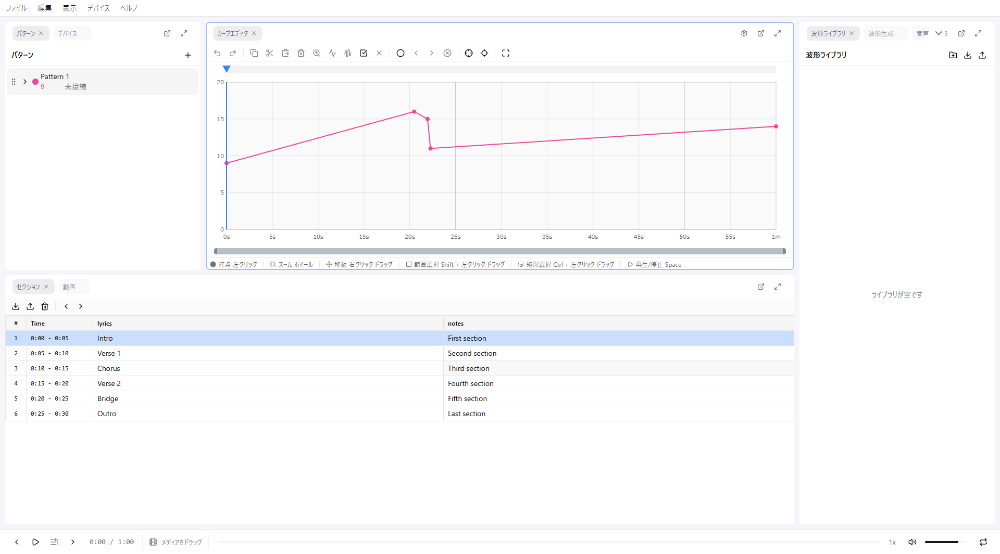
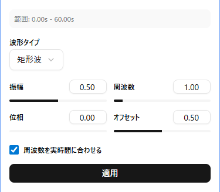
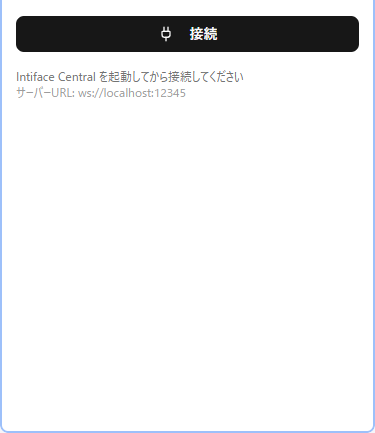
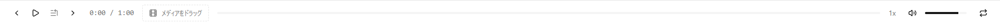

# 画面構成

remix-editor の画面は複数のパネルで構成されています。各パネルはドラッグで移動・リサイズが可能です。

## 全体レイアウト

画面は主に以下のエリアで構成されています：

| エリア | 内容 |
|--------|------|
| ヘッダー | メニューバー |
| 左パネル | パターンリスト、デバイス接続 |
| 中央パネル | カーブエディタ（メイン編集エリア） |
| 右パネル | ポイント編集、波形生成などのツール |
| フッター | 音声プレイヤー、再生コントロール |

## パターンリスト

コントロールパターンを管理するパネルです。

### 機能

- **パターンの追加**: 「+」ボタンで新規パターンを作成
- **パターンの選択**: クリックで編集対象を切り替え
- **パターンの削除**: ゴミ箱アイコンで削除（確認ダイアログあり）
- **名前の変更**: ダブルクリックで編集モード
- **色の変更**: カラーアイコンをクリック
- **表示/非表示**: 目のアイコンで切り替え

### パターン設定

パターンごとに以下の設定が可能です：

- 最大値（maxValue）
- 値ステップ（量子化の刻み幅）
- 負の値の許可
- 優先デバイスタイプ
- 優先アクチュエータータイプ

## カーブエディタ

メインの編集エリアです。時間（横軸）と値（縦軸）のグラフ上でポイントを編集します。

### 表示要素

- **グリッド**: 時間と値の目盛り
- **ポイント**: カーブを構成する点
- **カーブ線**: ポイント間を結ぶ線
- **再生ヘッド**: 現在の再生位置（赤い縦線）
- **選択範囲**: 選択中のエリア（青い矩形）
- **背景波形**: 音声の波形（オプション）

### 操作

- **左クリック**: ポイント追加 / 選択
- **ドラッグ**: ポイント移動 / 選択範囲移動
- **右ドラッグ**: ビューポートをパン（移動）
- **ホイール**: ズームイン / アウト
- **Shift + ドラッグ**: 範囲選択

詳しくは [カーブ編集](./04-curve-editing.md) を参照してください。

## ポイント編集パネル

選択中のポイントの座標を数値で編集できます。

- **Time**: ポイントの時間位置（秒）
- **Value**: ポイントの値

複数選択時は一括で相対移動が可能です。

## 波形生成パネル

選択範囲に波形パターンを生成します。

対応波形：
- サイン波
- 三角波
- 矩形波
- ランダム波
- 音声解析による波形

詳しくは [カーブ編集 > 波形生成](./04-curve-editing.md#波形生成) を参照してください。

## デバイスパネル

Intiface Central との接続状態とデバイス一覧を表示します。

- **接続/切断**: Intiface への接続を制御
- **スキャン**: デバイスを検索
- **デバイスリスト**: 接続中のデバイスを表示
- **テスト制御**: スライダーでデバイスを直接制御

詳しくは [デバイス接続](./06-devices.md) を参照してください。

## セクションパネル

CSV からインポートしたセクションデータを表示・編集します。

- **セクション一覧**: 時間範囲と属性を表示
- **ナビゲーション**: 矢印キーでセクション間を移動
- **選択範囲に設定**: セクションの範囲を選択範囲として設定
- **波形生成**: セクションの属性値から波形を自動生成

詳しくは [セクション](./05-sections.md) を参照してください。

## フッター

音声再生と再生コントロールを行います。

### 再生コントロール

- **再生/一時停止**: スペースキーまたはボタン
- **停止**: 再生を停止して先頭に戻る
- **再生速度**: 0.25x 〜 8x
- **音量**: 0% 〜 100%
- **リピート**: 選択範囲またはビューポートをループ再生

### 音声プレイヤー

- **波形表示**: 音声の波形を表示
- **シーク**: 波形をクリックして再生位置を変更
- **現在時間/合計時間**: 再生位置を表示

## パネルのカスタマイズ

各パネルは以下の操作でカスタマイズできます：

- **移動**: タイトルバーをドラッグ
- **リサイズ**: パネルの境界をドラッグ
- **最大化**: タイトルバーをダブルクリック

レイアウトは自動的に保存され、次回起動時に復元されます。
