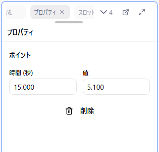

# 画面構成

remix-editor の画面は複数のパネルで構成されています。各パネルはドラッグで移動・リサイズ・タブ化が可能です。

## 全体レイアウト

画面は上から順に 3 つのエリアで構成されています。

| エリア | 内容 |
|--------|------|
| 上部 | メニューバー |
| 中央 | パネルエリア（自由に配置できる複数のパネル） |
| 下部 | 再生フッター |

## メニューバー

メニューは 5 つあります。

| メニュー | 主な項目 |
|----------|----------|
| ファイル | Remixを開く / Funscriptをインポート / CSVをインポート / 音声を読み込み / セクションデータをインポート / Remixを保存 / セクションデータをエクスポート / 波形ライブラリをインポート・エクスポート |
| 編集 | 元に戻す / やり直し / 設定（Ctrl + ,） |
| 表示 | レイアウト ▸（プリセット・ロック・リセット）/ パネル ▸（各パネルの表示切り替え） |
| デバイス | 接続... / 切断 |
| ヘルプ | ドキュメント / remix-editor について |

メニューバーの右端には、レイアウトがロックされているときにロックインジケータが表示されます。

## パネル一覧

パネルは 9 種類あります。**表示 > パネル** のチェックボックスで、それぞれの表示/非表示を切り替えられます。

| パネル | 役割 |
|--------|------|
| カーブエディタ | メインの編集エリア |
| パターン | パターンの一覧・設定・デバイスマッピング |
| デバイス | Intiface 接続とデバイス一覧・テスト制御 |
| 波形ライブラリ | 保存した波形スニペットをフォルダ管理 |
| セクション | セクションデータの表・波形生成 |
| プロパティ | 選択中のポイントを数値で編集 |
| 波形生成 | サイン波・三角波などの波形をプロシージャル生成 |
| 音声からの波形生成 | 音声の音量から波形を生成 |
| スロットル制御 | 縦スライダーで再生しながら値を記録 |

このほかに**設定**パネルがあり、こちらは **編集 > 設定**（Ctrl + ,）で必要なときに開きます。

既定のレイアウトでは、**スロットル制御** と **波形ライブラリ** が同じグループのタブとして配置されています。

### パネルヘッダーの操作

各パネルのヘッダー右側には次のボタンがあります。

- **歯車**: 関連する設定カテゴリを開く（カーブエディタ・デバイスのみ）
- **別ウィンドウで開く**: パネルを独立したウィンドウに切り出す
- **最大化 / 元に戻す**: パネルを一時的に画面いっぱいに広げる

レイアウトをロックしている間、最大化などの操作はグレーアウトします。

## カーブエディタ

メインの編集エリアです。時間（横軸）と値（縦軸）のグラフ上でポイントを編集します。

### パネル内の構成

上から順に次の要素が並びます（それぞれ 設定 > カーブエディタ で表示/非表示を切り替えられます）。

- **ツールバー**: Undo/Redo・選択操作・ピボット・プレイヘッド・ビューの各ボタン
- **クイック打点バー**: 一定間隔の値ボタン列。クリックまたは数字キーで再生位置に打点
- **キャンバス**: グリッド、ポイント、カーブ線、再生ヘッド（縦線）、選択範囲、ピボット、背景の音声波形
- **ビューポートスライダー**: 表示範囲の位置と幅を示すスライダー
- **ヒントバー**: 主要なマウス操作のヒント

### 主な操作

- **左クリック**: ポイント追加 / 選択
- **左ドラッグ**: ポイント移動
- **右ドラッグ**: ビューポートをパン（移動）
- **ホイール**: ズームイン / アウト
- **Shift + ドラッグ**: 時間範囲を選択
- **Ctrl + ドラッグ**: 矩形選択
- **右クリック**: コンテキストメニュー

詳しくは [カーブ編集](./04-curve-editing.md) を参照してください。

## パターンパネル

コントロールパターンを管理するパネルです。

- **パターンの追加**: 「+」ボタンで新規パターンを作成
- **パターンの選択**: クリックで編集対象を切り替え
- **設定の展開**: 名前の左の「▶」で設定欄を開閉
- **出力の ON/OFF**: 電源アイコンでデバイスへの出力を切り替え
- **表示/非表示**: 目のアイコンでカーブエディタ上の表示を切り替え
- **パターンの削除**: ゴミ箱アイコンで削除
- **設定**: 名前・色・最大値・ステップ・負の値・優先デバイス・優先アクチュエーター
- **デバイスマッピング**: パターンをどのアクチュエーターに送るかを設定

パターン名の下には、現在の再生位置での値と割り当て先のデバイスが表示されます。

詳しくは [パターン管理](./03-patterns.md) を参照してください。

## プロパティパネル

選択中のポイントの座標を数値で編集できます。

- **時間 (秒)**: ポイントの時間位置
- **値**: ポイントの値

複数選択時は選択中のポイント数と時間範囲が表示され、まとめて削除できます。始点・終点の時間は変更できません。

## 波形生成パネル

選択した時間範囲に波形を生成します。波形タイプはサイン波・三角波・三角波（傾き）・矩形波・ランダム波の 5 種類です。

「波形生成」ボタンでプレビューを開始し、パラメータを調整しながら結果を確認してから「適用」で確定します。

詳しくは [カーブ編集 > 波形生成](./04-curve-editing.md#波形生成) を参照してください。

## 音声からの波形生成パネル

読み込んだ音声（または別途選択した音声ファイル）の音量を解析して波形を生成します。こちらも同じくプレビュー → 適用の流れです。

## スロットル制御パネル

縦スライダーを操作して、そのときの値をポイントとして記録します。再生中に操作すると、時間ステップの間隔で連続的に記録されます。手弾きの感覚でカーブを作りたい場合に使います。

## 波形ライブラリパネル

よく使う波形をスニペットとして保存しておくパネルです。フォルダで整理でき、ファイルとして書き出し・読み込みもできます。

## デバイスパネル

Intiface Central との接続状態とデバイス一覧を表示します。

- **接続/切断**: Intiface への接続を制御
- **デバイスリスト**: 接続中のデバイスを表示（推定されたデバイスタイプがバッジで表示されます）
- **テスト制御**: 行を展開するとアクチュエーターごとのスライダーが表示され、デバイスを直接動かせます

詳しくは [デバイス接続](./06-devices.md) を参照してください。

## セクションパネル

CSV からインポートしたセクションデータを表形式で表示・編集します。

- **行クリック**: そのセクションをカーブエディタの選択範囲に設定し、再生位置をセクション先頭へ移動
- **セル編集**: クリックして直接編集
- **列ヘッダーの生成ボタン**: `_params` 列の値から波形を生成
- **ツールバー**: CSV のインポート/エクスポート、クリア、前後のセクションへ移動、再生位置への自動スクロール切り替え

詳しくは [セクション](./05-sections.md) を参照してください。

## フッター

音声再生と再生コントロールを行います。

- **トランスポート**: 先頭へ / 再生・一時停止 / 末尾へ（セクションがある場合は前後のセクションへ移動するボタンになります）
- **選択範囲の先頭から再生**
- **時間表示**: 現在の再生位置 / 全体の長さ
- **メディアドロップゾーン**: 音声ファイルのドロップ・削除
- **シークスライダー**: ドラッグで再生位置を変更（時間ステップにスナップします）
- **再生速度**: 0.25x / 0.5x / 0.75x / 1x / 1.25x / 1.5x / 2x
- **音量・ミュート**
- **ループ**: 選択範囲があればその範囲を、なければ全体をループ再生

## レイアウトのカスタマイズ

### パネルの配置

- **移動**: タブをドラッグして別の位置・グループへ
- **リサイズ**: パネルの境界をドラッグ
- **タブ化**: 別のパネルの上にドロップすると同じグループのタブになります

### レイアウトプリセット

**表示 > レイアウト** から、用途に応じたプリセットを選べます。

| プリセット | 用途 |
|------------|------|
| 音声モード（シンプル） | 音声に合わせた編集を最小構成で |
| 音声モード（詳細） | 音声編集向けに補助パネルも並べた構成 |
| 確認モード | 作成済みの Remix を再生して確認する構成 |
| シンプルモード | カーブ編集に集中する最小構成 |

**リセット** で既定のレイアウトに戻せます。

### レイアウトのロック

**表示 > レイアウト > レイアウトをロック** でレイアウトを固定できます。ロック中はパネルの移動・リサイズ・最大化ができなくなり、編集中に誤ってレイアウトを崩す事故を防げます。

メニューバー右端のロックインジケータをクリックしても解除できます。

レイアウトとロック状態は自動的に保存され、次回起動時に復元されます。
