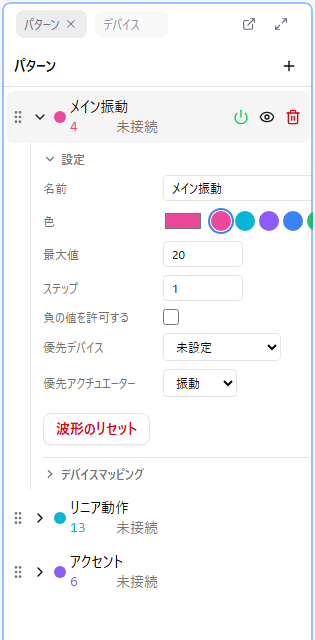

# パターン

コントロールパターンは、デバイスに送信する値の変化を定義するデータです。複数のパターンを作成し、それぞれ異なるデバイスに割り当てることができます。

## パターンの基本操作

### パターンを追加する

1. パターンパネルの「+」ボタンをクリック
2. 新しいパターンが作成され、自動的に選択されます

新規パターンには、始点（time=0, 値 0）と終点（time=最大時間, 値 0）の 2 点だけが置かれています。色は既定パレットから順に自動で割り当てられます。

### パターンを選択する

- パターンをクリックすると、そのパターンが編集対象（アクティブパターン）になります
- 選択中のパターンは強調表示されます
- カーブエディタで編集できるのはアクティブパターンだけです

### パターン設定を開く

- パターン名の左にある「▶」をクリックすると設定欄が展開します
- 名前・色・最大値などの設定と、デバイスマッピングがここに表示されます

### パターン名を変更する

- 設定欄の「名前」に入力します
- 「どの部位・どの動きのためのパターンか」がわかる名前を付けておくと、パターンが増えても管理が容易になります

### パターンの並び順を変える

- 行の左端のグリップをドラッグして並べ替えます

### パターンを削除する

- 行にマウスを乗せると表示されるゴミ箱アイコンをクリックします

確認ダイアログは出ませんが、Ctrl + Z で元に戻せます。

## 表示と出力の切り替え

パターンには**表示**と**出力**という 2 つの独立したスイッチがあります。混同しやすいので注意してください。

| アイコン | 意味 | 効果 |
|----------|------|------|
| 電源 | デバイス出力の ON/OFF | OFF にすると、そのパターンの値がデバイスに送信されなくなります（ON のときは緑色に光ります） |
| 目 | カーブエディタ上の表示 | 非表示にすると、キャンバスに描画されなくなります |

**重要**: 目のアイコンで非表示にしても、デバイスへの出力は止まりません。デバイスを黙らせたい場合は電源アイコンをオフにしてください。

- 電源アイコンは、出力が OFF のときは常に表示され、ON のときは行にマウスを乗せると表示されます
- 目のアイコンは行にマウスを乗せると表示されます

### 非表示パターンの編集制限

非表示にしたパターンは編集できません。打点・ドラッグ・コピー・切り取り・貼り付け・削除・波形生成・均等配置を行おうとすると、「波形が非表示のため…」というメッセージが表示されて操作がブロックされます。

### 複数パターンの同時表示

- 複数のパターンを表示状態にすると、カーブエディタに重ねて表示されます
- 各パターンは設定した色で区別されます
- 編集できるのはアクティブなパターンのみです

## パターン設定

パターンごとに以下の設定が可能です。

### 色

- カラーピッカーで自由に指定できます
- 隣に 8 色のプリセット（ピンク・シアン・バイオレット・ブルー・グリーン・イエロー・オレンジ・レッド）が並んでおり、クリックですぐ適用できます
- 色はカーブエディタでの表示に反映されます
- 役割ごとに色を変えると、複数パターン表示時に区別しやすくなります

### 最大値（maxValue）

- パターンの値の上限を設定します
- デフォルト: 20（新規パターンの初期値は 設定 > カーブエディタ > デフォルト最大値 で変更できます）
- デバイスに送信される値は 0% 〜 100% に正規化されます

**例**: 最大値が 20 の場合

- 値 10 → 50% でデバイスに送信
- 値 20 → 100% でデバイスに送信

### ステップ（valueStep）

- 値の量子化（スナップ）の刻み幅を設定します
- ポイントの値は自動的にこの刻みに揃えられます

**例**: ステップが 5 の場合、値は 0, 5, 10, 15, 20... にスナップします

### 負の値を許可する

- 有効にすると、パターンの最小値（minValue）が `-最大値` になり、0 未満の値を扱えるようになります
- 無効の場合、最小値は 0 です
- 負の値は回転方向の制御などに使用されます

最小値はクイック打点バーの下限にもなります。負の値を許可すると、クイック打点バーのボタンもマイナス側から並びます。

### 優先デバイスと優先アクチュエーター

パターンが「どの部位の、どんな種類の動きを想定しているか」を表す 2 つの設定です。**この 2 つの掛け合わせが、パターンの実質的なデバイスタイプを決めます**。自動接続や、再生側でのデバイス割り当てに使われます。

**優先デバイス**（部位）:

- ペニスデバイス
- アナルデバイス
- ニップルデバイス
- 膣内デバイス
- クリトリスデバイス
- 未設定（自動接続の対象にしない）

**優先アクチュエーター**（動きの種類）。標準で選べるのは次の 3 種類です。

- **Vibrate**: 振動
- **Rotate**: 回転
- **Linear**: リニア動作（往復運動）

設定 > 一般 > 実験的モード を有効にすると、Oscillate / Constrict / Inflate / Position / Spray / Temperature / Led が追加されます。

**例**: 「ペニスデバイス × Linear」ならピストン系の動き、「ニップルデバイス × Rotate」なら乳首向けの回転、というように組み合わせで意味が決まります。

**注意**: 優先アクチュエーターが未設定のパターンがあると、Remix の保存時にエラーになりファイルは書き出されません。保存前に必ず設定してください。

### 波形のリセット

- 始点と終点を残して、パターン内の中間ポイントをすべて削除します
- 実行前に確認ダイアログが表示されます（Ctrl + Z で元に戻せます）

## デバイスマッピング

パターン設定の下部に、接続中のデバイスとアクチュエーターの一覧が表示されます。

- **自動設定**: 優先デバイス・優先アクチュエーターに基づいて自動的に割り当てます
- **手動設定**: 特定のアクチュエーターを明示的に指定します
- 1 つのパターンを複数のアクチュエーターに割り当てることもできます
- 他のパターンがすでに使用しているアクチュエーターはグレーアウトします

詳しくは [デバイス](./05-devices.md) を参照してください。

## パターンごとではない設定

次の 2 つは**エディタ全体の設定**であり、パターンごとには設定できません。設定 > カーブエディタ で変更します。

- **最大時間**: タイムライン全体の長さ（秒）
- **時間ステップ**: 時間軸の最小単位（秒）

パターンごとに設定できるのは値方向の刻み（ステップ）だけです。

## 現在値の表示

パターン名の下には、現在の再生位置での値と、割り当て先のデバイス情報が常に表示されます。デバイスにどの程度の強度が送信されているか確認できます。割り当てがない場合は「未接続」と表示されます。

## パターン数の目安

- 必要なパターン数はデバイスの構成によります
- 1 デバイス 1 パターンが基本ですが、複数デバイスに同じパターンを送ることも可能です
