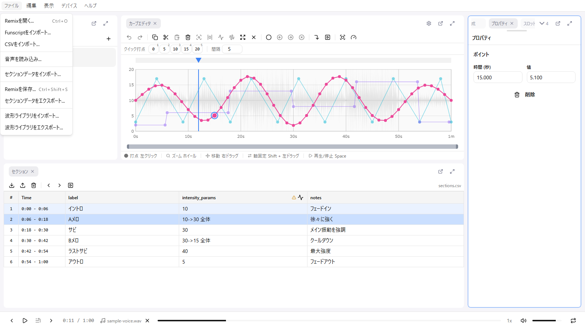

# インポートと保存

remix-editor は複数のファイル形式に対応しています。この章では、ファイルの読み込みと保存の全体像を説明します。

## 保存の 2 系統

remix-editor の「保存」には、独立した 2 つの系統があります。

| 系統 | 操作 | 保存先 | 使う場面 |
|------|------|--------|----------|
| **ローカル保存** | ファイル > Remixを保存...（Ctrl + Shift + S） | `.remix.json` ファイルとしてダウンロード | 手元にファイルを残す・共有する・バックアップする |
| **CMS への直接保存** | 画面上のフローティング「保存」ボタン | CMS（サーバー） | CMS から発行された専用 URL で開いて作業している場合 |

このほかに、編集内容がブラウザ内へ常時記録される[自動保存](#自動保存)がありますが、これはあくまで作業状態の一時的な記録で、上の 2 つの「保存」とは別物です。

## ファイルメニュー

| 項目 | ショートカット | 内容 |
|------|----------------|------|
| Remixを開く... | Ctrl + O | `.json` / `.remix` を読み込み |
| Funscriptをインポート... | - | `.funscript` を読み込み |
| CSVをインポート... | - | 汎用 CSV からパターンを読み込み |
| 音声を読み込み... | - | 音声ファイルを読み込み |
| セクションデータをインポート... | - | セクション CSV を読み込み |
| Remixを保存... | Ctrl + Shift + S | `.remix.json` としてダウンロード |
| セクションデータをエクスポート... | - | セクション CSV をダウンロード |
| 波形ライブラリをインポート... | - | `.wavelib.json` を読み込み |
| 波形ライブラリをエクスポート... | - | 波形ライブラリをダウンロード |

## インポート

### 音声ファイル

次のいずれかの方法で読み込めます。

- フッターのメディアドロップゾーンにドラッグ＆ドロップ（アプリ上のどこにドロップしても可）
- メディアドロップゾーンをクリックしてファイル選択
- **ファイル > 音声を読み込み...**

| 形式 | 拡張子 |
|------|--------|
| MP3 | .mp3 |
| WAV | .wav |
| M4A | .m4a |
| OGG | .ogg |
| FLAC | .flac |
| AAC | .aac |
| WebM | .webm |

**ファイルサイズの上限は 100MB** です。超えると「ファイルサイズが大きすぎます（最大100MB）」と表示され、読み込まれません。

読み込んだ音声はブラウザ（IndexedDB）に保存され、次回起動時に自動的に復元されます。ただし、**設定 > 一般 > 音声キャッシュ上限**（デフォルト 50MB）を超えるファイルは保存されず、リロードすると消えます。上限を `0` にするとキャッシュが無効になります（無制限ではありません）。

#### Remix の長さの調整

読み込んだ音声の長さと Remix の最大時間が 3 秒以上ずれている場合、「Remixの長さを調整」ダイアログが表示されます。

- **調整する**: 最大時間を音声の長さに合わせて延長/短縮します
- **調整しない**: 現在の最大時間を維持します

短縮する場合は、削除されるポイント数が警告として表示されます。

### Remix JSON

remix-editor の標準形式です。

**ファイル形式**: `.remix.json`（ファイル選択では `.json` / `.remix` を受け付けます）

**含まれるデータ**:
- すべてのコントロールパターン
- パターン設定
- ポイントデータ
- ピボット

**インポート手順**:
1. **ファイル > Remixを開く...** を選択
2. または、ファイルをドラッグ＆ドロップ
3. インポートダイアログで設定を確認
4. 「インポート」をクリック

**ダイアログの内容**:

| 項目 | 説明 |
|------|------|
| 検出された波形数 | ファイルに含まれるパターン数 |
| パターン一覧 | 各パターンの名前を編集できます（色チップ付き） |
| 既存の波形を残してインポート | オンにすると既存パターンを維持してマージします |

### Funscript

The Handy などで広く使われる形式です。

**ファイル形式**: `.funscript`

**変換処理**:
- 時間: ミリ秒 → 秒
- 値: 0-100 → 0-エディタの最大値

**ダイアログの内容**:

| 項目 | 説明 |
|------|------|
| Funscriptの最大値 / アクション数 | 読み込んだファイルの情報（表示のみ） |
| インポート先パターン | 新規作成、または既存パターンを選択 |
| エディタの最大値 | デフォルト 20（1 〜 1000） |
| 値の刻み | デフォルト 1（0.1 〜 10） |
| 値を上下反転 | 最大値と最小値を入れ替えてインポート |

### CSV（コントロールパターン）

汎用 CSV ファイルからパターンをインポートできます。元データと変換後の 2 ペインのプレビューを見ながら設定できます。設定内容は次回にも引き継がれます。

**データ設定**:

| オプション | 説明 |
|------------|------|
| データの方向 | 縦方向（列ごと）/ 横方向（行ごと） |
| 時間データ | 時間が入っている列/行 |
| 値データ | 値が入っている列/行 |
| 時間単位 | 秒 / ミリ秒 / デシ秒 / センチ秒 / 分 |

**値設定**:

| オプション | 説明 |
|------------|------|
| インポート先パターン | 新規作成、または既存パターンを選択 |
| 元データの最大値 | マッピング元のスケール |
| エディタの最大値 | マッピング先のスケール |
| 値の刻み | 量子化の単位 |
| 値を次のポイントまで保持 | 階段状に値を保持します |
| 正規化データとしてインポート（0-1範囲） | 元データを 0-1 の正規化値として解釈します |

**符号設定**:

| オプション | 説明 |
|------------|------|
| 値の符号を別の列/行から取得 | オンにすると符号データの列/行を指定できます |
| 符号の形式 | `+/-`、`1/-1`、`0/1`、`positive/negative`、`plus/minus`、`P/N`、`pos/neg` など |

ダイアログ下部には「◯ 個のポイントが生成されます」と生成数が表示されます。

### セクション CSV

セクションデータをインポートします。詳しくは [セクションデータ](./08-sections.md) を参照してください。

### 波形ライブラリ

保存した波形スニペットのライブラリをファイルとしてやり取りできます。詳しくは [波形ライブラリ](./10-waveform-library.md) を参照してください。

### ドラッグ＆ドロップ

ファイルをアプリケーション上のどこにドラッグ＆ドロップしても、ファイル形式を判別して適切なインポートダイアログが開きます。

| 拡張子 | 処理 |
|--------|------|
| .remix.json / .json / .remix | Remix JSON インポート |
| .funscript | Funscript インポート |
| .csv | CSV インポートダイアログ |
| .mp3, .wav など | 音声ファイル読み込み |

## ローカル保存（ファイルのダウンロード）

「保存」はブラウザへのダウンロードとして行われます。

### Remix JSON

remix-editor の標準形式で保存します。

**手順**:
1. **ファイル > Remixを保存...**（Ctrl + Shift + S）を選択
2. ブラウザのダウンロードとして保存されます

**ファイル名形式**: `{音声ファイル名}.{ISO8601タイムスタンプ}.remix.json`

**例**: `sample_audio.2026-07-28T10-30-00.remix.json`

音声が読み込まれていない場合、ファイル名は `untitled.{タイムスタンプ}.remix.json` になります。

**含まれるデータ**:
- すべてのコントロールパターン
- パターン設定（優先アクチュエーター含む）
- 全ポイントデータ
- ピボット

**保存できない場合**:

| 状況 | 表示されるメッセージ |
|------|----------------------|
| パターンが1つもない | エクスポートするパターンがありません |
| 優先アクチュエーターが未設定のパターンがある | 優先アクチュエータータイプが未設定のパターンがあります: {パターン名} |

この場合ダウンロードは行われません。パターン設定で優先アクチュエーターを設定してから再度実行してください。

### セクション CSV

セクションデータを CSV としてダウンロードします。

**手順**:
1. **ファイル > セクションデータをエクスポート...** を選択（セクションテーブルのツールバーからも可）
2. ブラウザのダウンロードとして保存されます

**ファイル名形式**:

| 状況 | ファイル名 |
|------|------------|
| 通常 | `sections-{YYYY-MM-DD}.csv` |
| 作品メタデータがある場合 | `{サークル名}-{作品番号3桁}-{チャプター番号3桁}.{YYYY-MM-DD}.csv` |

ギャップセクションはエクスポートされません。

**形式**: RFC 4180 準拠（適切なエスケープ処理）

## CMS への直接保存

CMS などから発行された URL（`?token=...&workId=...&chapterId=...`）で remix-editor を開くと、backend から音声・セクションデータ・Remix データが自動的に読み込まれます。読み込み後、URL からパラメータは取り除かれます。

トークンの権限とパラメータの条件を満たす場合のみ、画面上にドラッグで移動できるフローティングの「保存」ボタンが表示され、編集内容を CMS（backend）へ直接保存できます（保存 / 保存中... / 保存済み / エラー）。この場合、ファイルのダウンロードは発生せず、サーバー上のデータが更新されます。

トークンなしで開いた場合は完全なローカルモードとなり、backend 関連の UI は一切表示されません。ログイン機能はありません。

## 自動保存

### 作業データの自動保存

remix-editor には「ドキュメントを保存する」という概念はなく、編集内容は常にブラウザへ自動保存されます。

| データ | 保存先 | キー |
|--------|--------|------|
| コントロールパターン | LocalStorage | `editor-patterns` |
| セクションデータ | LocalStorage | `editor-sections` |
| 設定 | LocalStorage | `editor-settings` |
| 再生状態・ピボット | LocalStorage | `editor-audio` |
| ビューポート | LocalStorage | `editor-viewport` |
| パネルレイアウト | LocalStorage | `remix-editor-layout` / `remix-editor-layout-locked` |
| 音声ファイル | IndexedDB | - |

### 復元

次回起動時、保存されたデータが自動的に復元されます。

音声ファイルは **設定 > 一般 > 音声キャッシュ上限**（デフォルト 50MB）を超えると保存されません。

## データ管理

### 作業データのクリア

**設定 > 一般 > データ管理** から、カテゴリごとにデータを削除できます。

| カテゴリ | 削除されるもの |
|----------|----------------|
| 波形データ | 作成した波形パターン |
| 音声データ | 読み込んだ音声ファイル |
| セクションデータ | CSV から読み込んだセクション |
| 設定 | エディタ設定、ビューポート、プリセット |
| 全データ | 上記すべて |

**手順**:
1. **設定 > 一般** を開く
2. 「データ管理」の該当カテゴリで「クリア」をクリック
3. 確認ダイアログで実行

**注意**: この操作は取り消せません。クリア後、ページが自動的にリロードされます。必要なデータは事前にエクスポートしてください。

## v1 ファイルの互換性

### 旧形式のサポート

remix-editor v1 で作成したファイルも読み込めます。

| v1 形式 | v2 での扱い |
|---------|-------------|
| `{x, y}` 形式 | 自動的に `{time, value}` に変換 |
| 正規化値 | 実値に変換 |

### 変換時の注意

- v1 のファイルを v2 で保存すると、v2 形式になります
- v1 形式に戻すことはできません

## バックアップのすすめ

### 定期的なエクスポート

重要な作業は定期的にエクスポートして保存することをお勧めします。

- ブラウザのデータはクリアされる可能性がある
- 別の PC で作業を続ける場合にも便利

### エクスポートのタイミング

- 大きな編集を終えた後
- 作業を中断する前
- 共有する前

## トラブルシューティング

### インポートに失敗する

1. ファイル形式が正しいか確認
2. ファイルが破損していないか確認
3. 別のファイルで試す

### 保存（エクスポート）できない

優先アクチュエーターが未設定のパターンがあると、保存はブロックされます。パターン設定で優先アクチュエーターを設定してください。

### エクスポートしたファイルが開けない

1. ファイル拡張子が正しいか確認
2. テキストエディタで内容を確認
3. JSON 構文エラーがないか確認

### データが復元されない

1. ブラウザの設定で LocalStorage が有効か確認
2. プライベートブラウジングでないか確認
3. ブラウザのデータがクリアされていないか確認
4. 音声のみ消える場合は音声キャッシュ上限を確認
