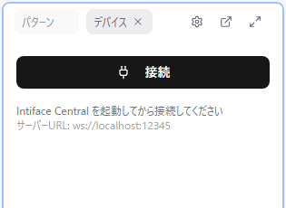

# デバイス

remix-editor は Intiface Central を経由して各種デバイスを制御できます。

## 必要なもの

- [Intiface Central](https://intiface.com/central/) - デバイス接続ミドルウェア
- 対応デバイス

## 対応デバイス

Intiface Central（Buttplug.io）が対応しているデバイス全般を利用できます。

| ブランド | 対応状況 |
|----------|----------|
| The Handy | 完全対応 |
| Lovense | 対応 |
| Vorze | 対応 |
| Svakom | 対応 |
| ToyCod | 対応 |
| BeYourLover / Fantasy Cup | 対応 |
| その他 | Intiface 対応デバイス全般 |

上記のブランドについては、デバイス名から**デバイスタイプ（部位）の自動推定**にも対応しています。

## Intiface Central のセットアップ

### インストール

1. [Intiface Central](https://intiface.com/central/) をダウンロード
2. インストーラーを実行
3. 初回起動時の設定を完了

### サーバー設定

1. Intiface Central を起動
2. 設定で WebSocket サーバーを有効化
3. ポート番号を確認（デフォルト: 12345）

## remix-editor との接続

### 接続手順

1. Intiface Central を起動し、サーバーを開始
2. remix-editor を開く
3. メニューの **デバイス > 接続...**、またはデバイスパネルの「接続」ボタンをクリック
4. 接続に成功すると、ボタンの表示が「切断」に変わり、デバイスリストが表示されます

切断する場合は **デバイス > 切断**、またはデバイスパネルの「切断」ボタンを使用します。未接続時のデバイスパネルには、設定中の Intiface サーバー URL がヒントとして表示されます。

### 自動接続

remix-editor は起動時に自動的に Intiface への接続を試みます（約1秒の遅延後）。

自動接続をオフにしたい場合は **設定 > デバイス > 自動接続** を無効にしてください。

### サーバー URL の変更

**設定 > デバイス > Intiface サーバー URL** で変更できます（デフォルト: `ws://localhost:12345`）。

## デバイスの検出

デバイスのスキャン（探索）は **Intiface Central 側で実行**します。remix-editor 側にスキャンボタンはありません。

1. デバイスの電源を入れる
2. ペアリングモードにする（デバイスによる）
3. Intiface Central でスキャンを実行

remix-editor は接続中、Intiface Central のデバイスリストを定期的に取得しているため、追加・削除されたデバイスは自動的にデバイスパネルへ反映されます。

## デバイスリスト

接続されたデバイスはデバイスパネルのリストに表示されます。

### 表示情報

- デバイス名
- デバイスタイプのバッジ（デバイス名から推定。推定できない場合は `?`）
- バッテリー残量（対応デバイスのみ）

デバイスタイプのバッジは、ペニスデバイス / アナルデバイス / ニップルデバイス / 膣内デバイス / クリトリスデバイス のいずれかで表示されます。

### 同名デバイスの区別

同じ名前のデバイスが複数接続されている場合、`Lovense Edge ①` `Lovense Edge ②` のように丸数字の通し番号が付きます。単独で接続されているデバイスには番号は付きません。

### デバイスの展開

デバイス名をクリックすると展開し、テスト制御スライダーが表示されます。

## アクチュエータータイプ

デバイスは1つ以上のアクチュエーターを持ちます。

### 標準のアクチュエーター

| タイプ | 表示名 | 説明 |
|--------|--------|------|
| Vibrate | 振動 | 振動の強さ |
| Rotate | 回転 | 回転（負の値で逆回転） |
| Linear | ピストン | 位置（指定位置まで移動） |

### 実験的モード

**設定 > 一般 > 実験的モード** を有効にすると、パターンの「優先アクチュエーター」に以下の追加タイプが選べるようになります。

| タイプ | 表示名 |
|--------|--------|
| Oscillate | 往復 |
| Constrict | 締め付け |
| Inflate | 膨張 |
| Position | 位置 |
| Spray | スプレー |
| Temperature | 温度 |
| Led | LED |

デバイス側の対応状況によっては期待どおりに動作しないことがあります。

## パターンとデバイスのマッピング

デバイスマッピングは**パターンパネル**で設定します。パターンを展開し、「デバイスマッピング」セクションを開いてください。

### マッピングの手順

1. パターンパネルでパターンを展開
2. 「デバイスマッピング」セクションを開く
3. デバイスごとに並んだアクチュエーター（`Vibrate 1`、`Linear 1` のように表示されます）のチェックボックスをオンにする

デバイスが接続されていない場合は「デバイスが接続されていません」と表示されます。

### 優先デバイス × 優先アクチュエーター

パターン設定には「優先デバイス」（部位）と「優先アクチュエーター」（動きの種類）があり、**この 2 つの掛け合わせがパターンの実質的なデバイスタイプを決めます**。自動設定はこの組み合わせに基づいてアクチュエーターを割り当て、Remix ファイルにも保存されて再生側でのデバイス割り当てに使われます。

**優先デバイス**: 未設定 / ペニスデバイス / アナルデバイス / ニップルデバイス / 膣内デバイス / クリトリスデバイス

**優先アクチュエーター**: 未設定 / 振動 / 回転 / ピストン（実験的モード時は前述の追加タイプも選択可）

> Remix のエクスポート・保存には**優先アクチュエーターの設定が必須**です。未設定のパターンがあるとエクスポートがブロックされます。

詳しくは [パターン > 優先デバイスと優先アクチュエーター](./03-patterns.md#優先デバイスと優先アクチュエーター) を参照してください。

### 1対多マッピング

1つのパターンを複数のデバイス/アクチュエーターに同時に送信できます。

### 競合の回避

既に他のパターンに接続されているアクチュエーターはグレーアウトし、「（パターン名 に接続中）」と表示されます。

## 再生中のデバイス制御

再生中、パターンの値は自動的に接続されたデバイスへ送信されます。パターンの**出力が有効**（電源アイコン）になっている必要があります。

### アクチュエータータイプによる違い

| タイプ | 動作 |
|--------|------|
| 振動（Vibrate） | 即時制御（値が直接強度になる） |
| 回転（Rotate） | 即時制御（正負で回転方向が変わる） |
| ピストン（Linear） | 位置ベース（指定位置まで移動する時間を伴う） |

### 再生ヘッドオフセット

音声とデバイスへの送信タイミングにオフセットを設定できます。

- デフォルト: **0.2秒**
- 範囲: -1秒 〜 +1秒（正の値でデバイスが先行、負の値で遅延）
- 用途: デバイスの応答遅延を補正

**設定 > 再生 > 再生ヘッドオフセット** で変更できます。

## テスト制御

デバイスを展開すると「テスト制御」が表示され、パターンとは無関係に各アクチュエーターを直接動かせます。

### スライダーによる直接制御

1. デバイスリストでデバイスを展開
2. アクチュエーターごとのスライダー（0% 〜 100%）を動かす
3. デバイスがリアルタイムで反応

- スライダーは **8% 以下で自動的に 0 にスナップ**します。
- **ピストン（Linear）はドラッグを離した時点でのみ送信**されます（移動時間 500ms）。振動・回転などはドラッグ中も即座に送信されます。

### すべて停止

各デバイスのテスト制御の最下部にある「すべて停止」ボタンで、**接続中の全デバイス**を即座に停止できます。

## トラブルシューティング

### 接続できない

1. Intiface Central が起動しているか確認
2. サーバーが開始されているか確認
3. **設定 > デバイス** の Intiface サーバー URL が正しいか確認（デフォルト: `ws://localhost:12345`）
4. ファイアウォールの設定を確認

### デバイスが見つからない

1. デバイスの電源が入っているか確認
2. デバイスが Bluetooth 範囲内にあるか確認
3. デバイスがペアリングモードか確認
4. Intiface Central でデバイスが認識されているか確認（スキャンは Intiface Central 側で行います）

### デバイスが反応しない

1. マッピングが正しく設定されているか確認
2. パターンの**出力が有効**になっているか確認（電源アイコン。目のアイコンは表示/非表示のみで出力は止まりません）
3. テスト制御スライダーで直接操作を試す
4. デバイスのバッテリー残量を確認

### 遅延が大きい

Bluetooth 接続の特性上、若干の遅延が発生します。

- 通常: 50〜100ms 程度
- 遅延が大きい場合: デバイスを PC に近づける
- **設定 > 再生 > 再生ヘッドオフセット**（デフォルト 0.2秒）で送信タイミングを補正できます

## 注意事項

- デバイスは使用前に必ず充電してください
- 長時間の使用は控えめに
- 異常を感じたら即座に「すべて停止」を実行
