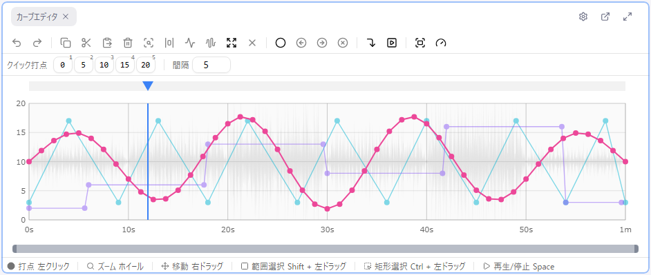
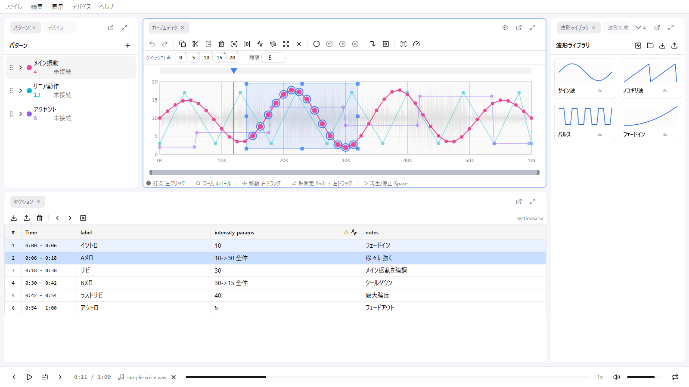

# カーブエディタ

カーブエディタは remix-editor のメイン編集エリアです。時間（横軸）と値（縦軸）のグラフ上で、時間軸に沿った値の変化をポイントで定義します。

ポイントは「時間（秒）」と「値」だけを持ちます。ポイントの種別や補間タイプはなく、**ポイント間はすべて直線で補間**されます。

## パネルの構成

上から順に次の要素が並びます（それぞれ 設定 > カーブエディタ で表示/非表示を切り替えられます）。

- **ツールバー**: Undo/Redo・選択操作・ピボット・プレイヘッド・ビューの各ボタン
- **クイック打点バー**: 一定間隔の値ボタン列。クリックまたは数字キーで再生位置に打点
- **キャンバス**: グリッド、ポイント、カーブ線、再生ヘッド（縦線）、選択範囲、ピボット、背景の音声波形
- **ビューポートスライダー**: 表示範囲の位置と幅を示すスライダー
- **ヒントバー**: 主要なマウス操作のヒント

## マウス操作

| 操作 | 動作 |
|------|------|
| 左クリック（空白） | 打点。追加したポイントが選択され、そのままドラッグで位置を調整できます |
| 左クリック（ポイント上） | ポイントを選択。Ctrl + クリック / Shift + クリックで選択に追加 |
| 左ドラッグ（ポイント上） | ポイントを移動。複数選択中のポイントを掴むと一括で移動します |
| Shift + 左ドラッグ | 時間範囲を選択（値方向は全域） |
| Ctrl + 左ドラッグ | 矩形選択 |
| 右ドラッグ | ビューポートをパン（ポイントの上でもパンになります） |
| ホイール | カーソル位置を基準にズーム |
| 右クリック | コンテキストメニュー |
| 選択範囲のハンドルをドラッグ | 選択範囲のリサイズ（後述） |
| 再生ヘッド領域を左クリック / ドラッグ | シーク。領域内のピボットはドラッグで移動できます |

マウスの割り当ても 設定 > ショートカット で変更できます。たとえばズームをボタンに割り当てると横ドラッグでズーム、パンをホイールに割り当てるとホイールでパンになります。

## ポイント操作

### ポイントを追加する

- カーブエディタの空いている場所を**左クリック**します
- 追加されたポイントはそのまま選択状態になるので、離さずにドラッグして位置を微調整できます

### ポイントを移動する

1. ポイントをドラッグします
2. **Shift キーを押しながら**ドラッグすると、動き出した方向（時間方向または値方向）に軸が固定されます

**注意**: 始点（time=0）と終点（time=最大時間）は値のみ変更でき、時間は動かせません。

### ポイントを削除する

1. ポイントを選択
2. **Delete** キーを押す

**注意**: 始点と終点は削除できません。

### ポイントの座標を数値で編集する

ポイントを選択すると、**プロパティ**パネルで「時間 (秒)」と「値」を数値で編集できます。詳しくは [プロパティ](./07-properties.md) を参照してください。

### クイック打点バー

カーブエディタ上部の**クイック打点バー**を使うと、再生しながらワンアクションで打点できます。

- ボタンは、パターンの最小値から一定の**間隔**（既定 5、バー右端の数値入力で変更）刻みで並び、末尾は必ず最大値になります
- ボタンをクリック、または**数字キー 1〜9**を押すと、**現在の再生位置**にその値のポイントが追加され選択されます
- 数字キーはカーブエディタがアクティブなときだけ有効で、修飾キーを押していると反応しません

再生しながらリズムに合わせて連打する使い方を想定しています。バーの表示は 設定 > カーブエディタ > クイック打点バーを表示 で切り替えられます。

### 打点ナビゲーション

作成済みのポイントを順に辿るショートカットです。

| キー | 動作 |
|------|------|
| Alt + → | 次のポイントへ再生位置をジャンプ |
| Alt + ← | 前のポイントへ再生位置をジャンプ |
| N | 次のポイントを選択 |
| B | 前のポイントを選択 |

## 選択範囲操作

### 範囲選択

- **Shift + ドラッグ**: 時間範囲を選択します（値方向は全域が対象）
- **Ctrl + ドラッグ**: 矩形の範囲を選択します
- **Ctrl + A**: すべてのポイントを選択
- **Escape**: 選択を解除

### 選択したポイントの移動

選択中のポイントのいずれかを掴んでドラッグすると、選択されたポイントが一括で移動します。Shift を押しながらだと軸が固定されます。

### 選択範囲のリサイズ

選択範囲のハンドル（辺や角）をドラッグすると、範囲内のポイントを変形できます。

| ハンドル | 動作 |
|----------|------|
| 左辺 / 右辺 | 時間範囲の開始 / 終了を移動 |
| 上辺 / 下辺 | 上端 / 下端の値を平行移動（傾きは維持されます。比例スケールではありません） |
| 四隅 | その隅だけを動かす（台形に変形） |
| Alt + 辺 | 反対側の辺も逆方向に動く対称リサイズ |

リサイズ中、値はステップに量子化されますが、時間は量子化されません。

### 選択範囲にズーム

1. 範囲を選択
2. **Z** キーを押す

ビューポートが選択範囲に合わせてズームします。

### ポイントを均等配置

1. 時間範囲を選択し、その中の 2 つ以上のポイントを選択します
2. **E** キーを押す（またはツールバー・コンテキストメニューから）

選択中のポイントが、選択範囲の中で時間軸上に等間隔で並び直します。手で打った点のタイミングを揃えたいときに使います。始点（time=0）と終点（time=最大時間）は動きません。

## ビューポート操作

### ズームイン/アウト

- **マウスホイール**を回します（カーソル位置が基準になります）
- ズーム感度と方向の反転は 設定 > カーブエディタ で調整できます

### パン（移動）

- **右クリックしながらドラッグ**します
- カーブエディタ下部のビューポートスライダーでも移動できます

### 全体表示

- ツールバーの「全体表示」ボタン、またはコンテキストメニューの「全体表示」を選択します

### 再生位置へジャンプ / 追尾

- **J** キーで、ビューポートが現在の再生位置に移動します。編集中に再生位置を見失った時に便利です
- **F** キー（またはツールバー）で「再生位置を追尾」を切り替えると、再生中にビューポートが自動で追従します。デフォルトは無効で、**設定 > 再生 > 再生位置を追尾** でも変更できます

## ピボット

ピボットは、時間軸上に置ける目印です。サビの頭など、繰り返し戻りたい位置に置いておくと便利です。

| キー | 動作 |
|------|------|
| P | 現在の再生位置にピボットを追加 |
| Shift + P | 次のピボットへジャンプ（末尾まで行くと先頭へ戻ります） |
| Ctrl + Shift + P | 前のピボットへジャンプ（先頭まで行くと末尾へ循環） |
| Ctrl + P | 選択中のピボットに再生位置を合わせる |

- ピボットは**いくつでも登録できます**（ほぼ同じ位置（±0.001秒以内）への重複追加は無視されます）
- 再生ヘッド領域でドラッグして位置を動かせます
- 削除はツールバー、またはコンテキストメニューの「ピボットを削除」「選択範囲のピボットを削除」から行います
- ピボットは自動保存され、Remix ファイルにも保存されます。Undo の対象にもなります

## 速度カラーリング

カーブの各区間を、値の変化の速さに応じて青（遅い）→赤（速い）で色分けする表示モードです。デバイスにとって急すぎる動きを見つけるのに役立ちます。

ツールバーの速度メーターアイコンでオン/オフを切り替えます。正規化の方法は 設定 > カーブエディタ で選べます。

| モード | 基準 |
|--------|------|
| 手動（既定） | 設定した速度しきい値（既定 100 値/秒） |
| 自動 | そのパターン内の最大速度 |
| 表示範囲 | 画面に見えている範囲の最大速度 |

## 背景波形表示

カーブエディタの背景に音声の波形を表示できます。**設定 > カーブエディタ > 波形背景を表示** で切り替えます（デフォルトで有効）。

| 設定 | 説明 | デフォルト |
|------|------|-----------|
| 波形自動スケーリング | 画面内の最大値に合わせて自動調整 | 有効 |
| 波形倍率 | 波形の高さ（%） | 50% |
| 波形サンプル数 | 波形の解像度（50 〜 4000） | 2000 |

サンプル数を増やすと詳細になりますが、処理が重くなります。

## クリップボード操作

| キー | 動作 |
|------|------|
| Ctrl + C | 選択ポイントをコピー |
| Ctrl + X | 選択ポイントを切り取り |
| Ctrl + V | **現在の再生位置**を基準に貼り付け |

ポイントは相対時間でコピーされるため、別の位置に何度でも貼り付けられます。クリップボードは[波形ライブラリ](./10-waveform-library.md)と共有されています。

**注意**: 貼り付け位置に既存のポイントがある場合、始点・終点以外は上書きされます。

## スロットル制御

再生中にリアルタイムで値を入力できる機能です。専用の「スロットル制御」パネルで操作します。手弾きの感覚でカーブを作りたい場合に使います。

デフォルトのレイアウトでは「波形ライブラリ」と同じグループのタブになっています。パネルを閉じてしまった場合は **表示 > パネル > スロットル制御** で再表示できます。

### 使い方

1. アクティブなパターンを選択
2. 再生を開始
3. 縦スライダーを掴んでドラッグ

- スライダーを掴んだ時点で、現在の再生位置にポイントが1つ追加されます
- **再生中のみ**、ドラッグ中の値が時間ステップ間隔で連続的に記録されます
- 値は 0 〜 1 の割合として扱われ、パターンの最大値に掛けた値が記録されます
- ドラッグを離すと、その一連の記録が Undo 1回分にまとめられます

## 量子化（クォンタイゼーション）

ポイントをグリッドにスナップさせる機能です。

### 時間量子化

- 設定 > カーブエディタ > 時間ステップ で設定します（既定 0.01 秒）
- エディタ全体で共通の設定です

### 値量子化

- パターン設定の「ステップ」で設定します
- パターンごとに設定できます

## Undo/Redo

編集操作は取り消し・やり直しが可能です。

- **Ctrl + Z**: 元に戻す（Undo）
- **Ctrl + Shift + Z**: やり直す（Redo）

履歴はエディタ全体で 1 本のスタックとして管理されます。カーブの編集だけでなく、セクションの編集や最大時間・時間ステップの変更も同じ履歴に積まれます。

## コンテキストメニュー

カーブエディタ上で**右クリック**するとコンテキストメニューが表示されます。

| 項目 | 機能 |
|------|------|
| コピー / 切り取り / 貼り付け / 削除 | クリップボード操作 |
| 波形を生成... | [波形生成](./09-waveform-generation.md)パネルを開く |
| 音声から波形を生成... | [音声からの波形生成](./09-waveform-generation.md#音声からの波形生成)パネルを開く |
| ライブラリに保存... | 選択範囲の波形を[波形ライブラリ](./10-waveform-library.md)へ保存 |
| ポイントを均等配置 | 選択ポイントを等間隔に並べ直す |
| すべて選択 | 全ポイントを選択 |
| 選択範囲にズーム | 選択範囲を画面いっぱいに表示 |
| 全体表示 | 全体が収まるようにビューを戻す |
| ピボットを追加 / 削除 / 選択範囲のピボットを削除 | ピボット操作 |
| 元に戻す / やり直し | Undo / Redo |

## 非表示パターンでの操作制限

アクティブなパターンを非表示（目のアイコンをオフ）にしていると、打点・ドラッグ・コピー・切り取り・貼り付け・削除・波形生成・均等配置がすべてブロックされ、「波形が非表示のため…」というメッセージが表示されます。編集する前にパターンを表示状態に戻してください。
