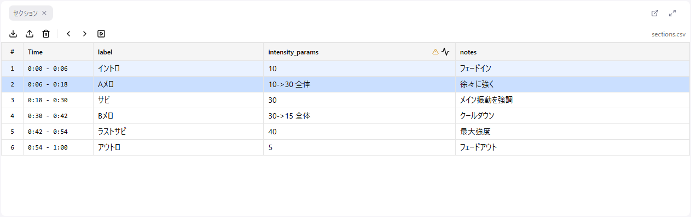

# セクションデータ

セクションデータは、音声の区間（開始時間〜終了時間）ごとに付けられた情報です。文字起こしやメモなどの任意の属性を持たせられます。

主な使い方は**見ること**です。

- **文字起こしの確認**: 音声のどこで何を話しているかを表で確認しながら編集する
- **メモ**: 区間ごとの注意点や意図を書き留めておく
- **ナビゲーション**: 行をクリックしてその場面へ一気に移動する

発展的な使い方として、区間の属性値から[波形を自動生成する機能](#セクションからの波形生成)もあります。

## セクションのインポート

### CSV ファイル形式

セクション CSV には以下の列が必要です：

| 列名 | 必須 | 説明 |
|------|------|------|
| start_time | ○ | セクションの開始時間（秒） |
| end_time | ○ | セクションの終了時間（秒） |
| （その他） | × | 任意の属性列（文字起こし・メモ・強度など） |

**CSV 例**:
```csv
start_time,end_time,intensity_params,note
0,10,5,イントロ
10,30,10,サビ
30,45,15,最高潮
45,60,5,アウトロ
```

**注**: 波形生成に使用する列は `_params` 接尾辞が必要です（詳細は[後述](#セクションからの波形生成)）。

### インポート方法

1. **ファイル > セクションデータをインポート...** を選択
2. CSV ファイルを選択

セクションパネルのツールバーからもインポートできます。CSV ファイルをアプリ上にドラッグ＆ドロップしてもインポートできます。

## セクションパネル



インポートしたセクションは表形式で表示されます。

### 行をクリックしたときの動作

行をクリックすると、次の 2 つが同時に行われます。

1. カーブエディタの選択範囲が、そのセクションの時間範囲に設定される
2. 再生位置がセクションの開始時間へ移動する

「この場面のカーブを直したい」というとき、行をクリックするだけで対象範囲の選択と頭出しが済みます。

**Shift + クリック**で複数のセクションをまとめて選択できます。選択したセクション数はツールバーにバッジで表示されます。

### ツールバー

| ボタン | 機能 |
|--------|------|
| インポート | セクション CSV を読み込む |
| エクスポート | 現在のセクションを CSV に書き出す |
| クリア | セクションをすべて削除する |
| ◀ / ▶ | 前 / 次のセクションへ移動（再生位置も移動します） |
| 自動スクロール | 再生位置に合わせて表の表示位置を自動追従させる |

右端には、選択中のセクション数と読み込んだ CSV のファイル名が表示されます。

再生しながら**自動スクロール**を有効にしておくと、いま再生している場面の行が常に見える位置に保たれます。文字起こしを目で追いながらの確認に便利です。

### セルの編集

メモの追記など、セルの内容は表の上で直接編集できます。

1. セルをクリックして編集モードに入る
2. 値を入力
3. **Escape** でキャンセル、セル外をクリックすると自動的に保存されます

確定のキーは列の種類によって異なります。

| 列の種類 | 確定 | 改行 |
|----------|------|------|
| 1 行のテキスト | Enter | — |
| 複数行のテキスト | Ctrl + Enter または Shift + Enter | Enter |

`_params` 列のセルには、強度を直感的に調整できるスライダーが付いています。

## セクションナビゲーション

キーボードでセクション間を移動できます。

| キー | 動作 |
|------|------|
| ← | 前のセクションへ移動 |
| → | 次のセクションへ移動 |
| Shift + ← | 選択範囲を前のセクションまで拡張 |
| Shift + → | 選択範囲を次のセクションまで拡張 |

**注意**: キーボードでの移動は、選択中のセクションが変わるだけで**再生位置は動きません**。再生位置も一緒に動かしたい場合は、行をクリックするか、ツールバー・フッターの ◀ ▶ ボタンを使ってください。

セクションが読み込まれていると、フッターのトランスポートの両端ボタンも「前 / 次のセクションへ移動」になります。

## ギャップセクション

セクション間に空白がある場合、自動的に「ギャップセクション」が生成されます。

- 表示: グレー背景、値は「-」
- 編集: 不可
- ナビゲーション: 移動の対象には含まれます

**注意**: 波形生成では、ギャップセクションは**直前のセクションの値を引き継ぎます**（範囲指定の場合は終了値を引き継ぎます）。表示上は「-」ですが、値が 0 になるわけではありません。

## セクションのエクスポート

編集したセクションデータを CSV として保存できます。

1. **ファイル > セクションデータをエクスポート...** を選択（セクションパネルのツールバーからも可）
2. ファイルがダウンロードされます

ファイル名は次の形式になります。

- 通常: `{音声ファイル名}.{タイムスタンプ}.sections.csv`
- 作品情報付きで開いている場合: `{サークル名}-{作品番号}-{章番号}.{日付}.csv`

## セクションからの波形生成

ここからは発展的な使い方です。セクションの属性値から自動的に波形を生成できます。

### 波形生成可能な列

**重要**: 波形生成機能は、列名が `_params` で終わる列でのみ使用できます。

**例**:
- `intensity_params` ✓ 波形生成可能
- `speed_params` ✓ 波形生成可能
- `intensity` ✗ 波形生成不可（テキスト列として扱われる）
- `note` ✗ 波形生成不可

CSV を作成する際は、波形生成に使用したい列には必ず `_params` 接尾辞を付けてください。

### 生成ダイアログを開く

- セクションパネルの列ヘッダーにある波形アイコンをクリックします

プリセットが未設定の `_params` 列には、ヘッダーに警告アイコンが表示されます。

### ダイアログの設定項目

| 項目 | 説明 |
|------|------|
| 対象列 | どの `_params` 列の値を使うか |
| 対象セクション | 「全て」または「選択範囲のみ」 |
| プリセット | 設定一式の保存・呼び出し |
| 文字ルール | 値に添えたテキストの解釈方法 |
| 波形タイプ | 直線波形 / 三角波 |
| 高度なオプション | グループ化・位相継続・ポイント最適化 |

### 波形タイプ

#### 直線波形

セクションの強度値をそのまま直線で表現します。

- 単一値: フラットな線を生成
- 範囲値: 傾斜した線を生成

#### 三角波

セクションの強度値に基づいて三角波を生成します。「三角波傾き設定」で波の速さを制限できます。

- **最小傾き（値/秒）**: これより緩やかな傾斜にはしない
- **最大傾き（値/秒）**: これより急な傾斜にはしない

デバイスが追従できない急激な変化を避けたい場合に使用します。

### 文字ルール

`_params` の値に添えたテキストをどう解釈するかを設定します。ルールは「この文字なら → こうする」という形で必要な数だけ追加できます。

| ルール | 説明 |
|--------|------|
| 値の範囲 | そのテキストのときの動作範囲（最小・最大）を指定する |
| 正負 | 値を正方向・負方向のどちらで出力するかを指定する |
| 波形生成のON/OFF | そのテキストのときは波形を生成する / 無視する |

### プリセット

文字ルールを含む設定一式をプリセットとして保存できます。

- **保存**: 名前を付けて保存
- **削除**: 選択中のプリセットを削除
- **エクスポート / インポート**: プリセットをファイルとしてやり取りできます

プリセットは列ごとに記憶されるため、「intensity_params 列にはプリセット A、speed_params 列にはプリセット B」といった使い分けができます。

### 高度なオプション

| オプション | 効果 |
|------------|------|
| グループ化 | 同じ設定・強度が続くセクションをひとまとまりとして扱います |
| 位相継続 | グループ内で波の位相を継続させ、境目で波形が途切れないようにします |
| ポイント最適化 | 意味のない中間ポイントを削減し、出力を軽くします |

グループはギャップセクションで分割され、グループ間では位相がリセットされます。

### パラメータの書式

`_params` 列に入力する値の書式について説明します。

#### 基本形式

```
{強度 0-100}{テキスト}
```

**例**:
- `30` - 強度 30
- `30全体` - 強度 30、テキスト「全体」

強度は 0〜100 の範囲にクランプされ、内部では 0〜1 に正規化されます。テキストだけを書いた場合、強度は 0 として扱われます。

#### 変化する値

```
{開始値}->{終了値}{テキスト}
```

**例**:
- `10->30` - 強度が 10 から 30 へ変化
- `0->50全体` - 強度が 0 から 50 へ変化、テキスト「全体」

#### テキストの用途

テキスト部分は「文字ルール」と組み合わせて使用します。たとえばリニアデバイス向けに「このテキストのときは動作範囲を 70〜100% に制限する」、回転デバイス向けに「このテキストのときは負の方向（逆回転）で出力する」といったルールを作っておくと、セクションの表を書くだけで動きを描き分けられます。
