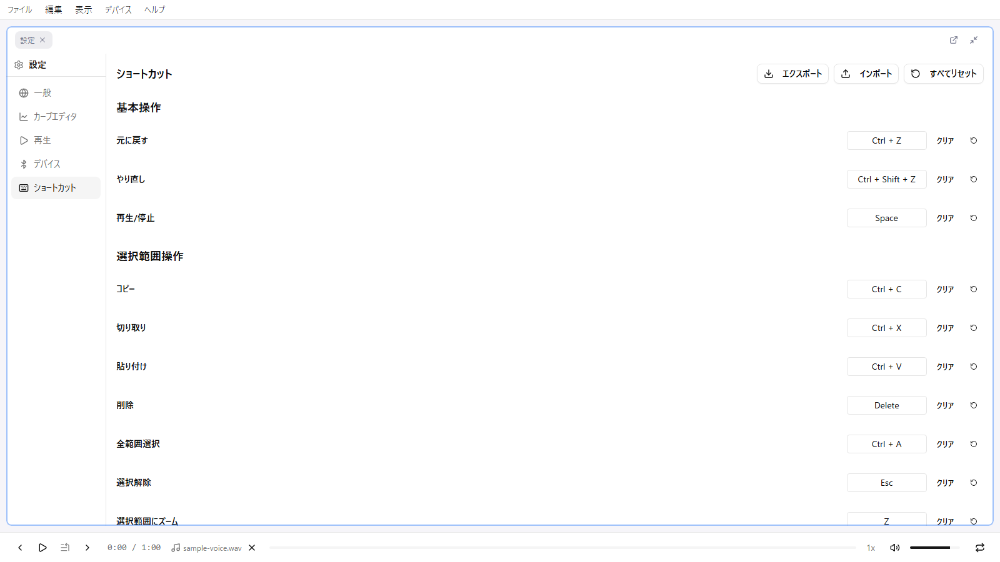

# ショートカット

remix-editor のキーボードショートカット一覧です。ここに記載しているのは**デフォルト**の割り当てで、ほぼすべて設定画面から変更できます。

> **※ 印のショートカットは、カーブエディタパネルがアクティブなときのみ動作します。** パネルのタブや内部をクリックしてアクティブにしてから使用してください。

## 基本操作

| キー | 機能 |
|------|------|
| Ctrl + Z | 元に戻す（Undo） |
| Ctrl + Shift + Z | やり直し（Redo） |
| Space | 再生/停止 |

## アプリケーション

| キー | 機能 |
|------|------|
| Ctrl + O | インポート（Remixを開く） |
| Ctrl + Shift + S | エクスポート（Remixを保存） |
| Ctrl + , | 設定を開く |

## 選択範囲操作 ※

| キー | 機能 |
|------|------|
| Ctrl + C | コピー |
| Ctrl + X | 切り取り |
| Ctrl + V | 貼り付け |
| Delete | 削除 |
| Ctrl + A | 全範囲選択 |
| Escape | 選択解除 |
| Z | 選択範囲にズーム |
| E | ポイントを均等配置 |

## 波形生成 ※

| キー | 機能 |
|------|------|
| W | 波形生成 |
| A | 音声からの波形生成 |

## 再生操作

| キー | 機能 | 備考 |
|------|------|------|
| J | 再生位置へジャンプ | ※ |
| F | 追尾モード切り替え | ※ |
| P | ピボット設定（追加） | |
| Shift + P | 次のピボットへジャンプ | |
| Ctrl + Shift + P | 前のピボットへジャンプ | |
| Ctrl + P | 再生位置をピボットに合わせる | |
| Alt + → | 次の打点へジャンプ | |
| Alt + ← | 前の打点へジャンプ | |
| N | 次の打点を選択 | |
| B | 前の打点を選択 | |
| Shift + > | 再生速度を上げる | |
| Shift + < | 再生速度を下げる | |

ピボットは複数登録でき、Shift + P / Ctrl + Shift + P は登録順に循環します。

## セクション操作

| キー | 機能 |
|------|------|
| ← | 前のセクションへ移動 |
| → | 次のセクションへ移動 |
| Shift + ← | 前のセクションも選択範囲に含める |
| Shift + → | 次のセクションも選択範囲に含める |

キーボードでのセクション移動は選択インデックスのみが動き、再生位置や選択範囲は変わりません。再生位置も一緒に動かしたい場合は、セクションテーブルの行クリックやツールバーのボタンを使用してください。

## クイック打点 ※

| キー | 機能 |
|------|------|
| 1 〜 9 | クイック打点バーの左から n 番目の値で打点 |

- クイック打点バーが表示されている（**設定 > カーブエディタ > クイック打点バーを表示**）ときのみ有効です
- Ctrl / Shift / Alt を押している間は無効です
- このキーは固定で、設定画面から変更できません

## マウス操作

| 操作 | 機能 |
|------|------|
| 左クリック（空白） | 打点（そのままドラッグで移動も可） |
| 左クリック（ポイント上） | ポイント選択（Ctrl / Shift + クリックで追加選択） |
| 左ドラッグ（ポイント上） | ポイント移動（複数選択中は一括移動） |
| Shift + 左ドラッグ | 範囲選択（時間範囲。値方向は全域） |
| Ctrl + 左ドラッグ | 矩形選択 |
| 右ドラッグ | 移動（パン） |
| マウスホイール | カーソル位置基準でズーム |
| 右クリック | コンテキストメニュー |
| ハンドルドラッグ | 選択範囲リサイズ |
| 再生ヘッド領域 左クリック / ドラッグ | 再生位置を変更（領域内のピボットはドラッグで移動） |

ポイントの上でも右ドラッグはパンが優先されます。ホイールのズーム感度・移動感度・方向の反転は **設定 > カーブエディタ** で調整できます。

## 選択範囲リサイズの詳細

| ハンドル | 動作 |
|----------|------|
| 左辺/右辺 | 時間範囲の開始/終了を移動 |
| 上辺/下辺 | 上端/下端の値を平行移動（傾きは維持され、比例スケールではありません） |
| 四隅 | その隅だけを移動（台形変形） |
| Alt + 辺 | 反対側も逆方向に動く対称リサイズ |

リサイズで変化した値のみが量子化され、時間は量子化されません。なお **Alt + 四隅は現在効果がありません**。

## ショートカットのカスタマイズ

ショートカットは設定画面からカスタマイズできます。

### 設定画面を開く

1. **設定**（Ctrl + ,）を開く
2. **ショートカット** カテゴリを選択

基本操作 / 選択範囲操作 / 波形生成 / 再生操作 / セクション操作 / アプリケーション / マウス操作 のカテゴリに分かれています。

### キーの変更

1. 変更したい項目の入力欄をクリックする（「キーを入力...」に変わります）
2. 新しいキーの組み合わせを押す

割り当てが他のショートカットと重複している場合は警告が表示されます。「クリア」で割り当てを解除できます。

### マウス操作の変更

打点・ズーム・移動・範囲選択・矩形選択・コンテキストメニューは、ボタン（左/右/中）や修飾キーを変更できます。ズームと移動はホイールにも割り当てられるため、「ホイールで移動、ドラッグでズーム」といった構成にもできます。

### デフォルトに戻す

「すべてリセット」ボタンで、全ショートカットを初期設定に戻せます。

### 設定のエクスポート/インポート

ショートカット設定を JSON ファイルとして保存・読み込みできます。

1. 「エクスポート」でファイルに保存
2. 「インポート」でファイルから読み込み

別の環境に設定を移行する際に便利です。

## 注意事項

### 入力フォーカス中

テキスト入力中（パターン名の編集、セクションの編集など）は、グローバルショートカットが無効になります。

**例外**: Escape キーは入力を終了して通常モードに戻ります。

### パネルのアクティブ状態

※ 印のショートカットはカーブエディタパネルがアクティブなときだけ動作します。セクションテーブルなど別のパネルを操作した直後は、カーブエディタをクリックしてから使用してください。

再生/一時停止・Undo/Redo・インポート/エクスポート・設定・セクション移動・ピボット・打点ナビゲーションは、どのパネルがアクティブでも動作します。

### モーダル表示中

モーダルダイアログが開いている間は、Escape キー以外のグローバルショートカットは無効です。

- **Escape**: モーダルを閉じる

### ブラウザとの競合

一部のショートカットはブラウザの機能と競合する場合があります。

| キー | ブラウザ機能 | remix-editor での動作 |
|------|--------------|----------------------|
| Ctrl + O | ファイルを開く | Remixを開くに割り当て |
| Ctrl + P | 印刷 | ピボット機能に割り当て |
| F5 | ページ更新 | 通常通り機能 |

**ヒント**: 誤ってページを更新しても、自動保存されたデータは復元されます。
