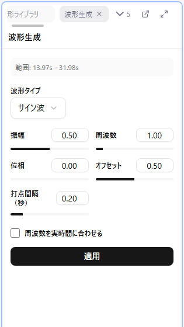

# 波形生成

選択した時間範囲へ、三角波などの波形をまとめて生成する機能です。行為区間のストロークはほぼ三角波になるため、**波形生成パネルは制作の主力機能**です。音声から・セクションからの自動生成は補助的な機能です。

生成方法は 3 つあります。

| 方法 | 元になるもの | 説明 |
|------|--------------|------|
| [波形生成パネル](#波形生成パネル) | 波形タイプとパラメータ | サイン波・三角波などをプロシージャル生成 |
| [音声からの波形生成](#音声からの波形生成) | 音声の音量 | 音量の変化を波形に変換 |
| [セクションからの波形生成](./08-sections.md#セクションからの波形生成) | セクションの `_params` 列 | 区間ごとの強度値から一括生成 |

## 波形生成パネル

### 手順

1. **時間範囲を選択**します（Shift + ドラッグ、またはポイントを 2 つ以上選択）
2. **W** キー（または右クリック > 波形を生成...）で波形生成パネルを開きます
3. パネルの「波形生成」ボタンを押すと**プレビュー**が始まります
4. パラメータを変更すると、キャンバス上のプレビューがリアルタイムに更新されます
5. 納得したら「適用」で確定します（「キャンセル」でプレビューを破棄）

**注意**: 時間範囲が選択されていないと生成できません。

### 波形タイプとパラメータ

| タイプ | 固有のパラメータ |
|--------|------------------|
| サイン波 | 打点間隔（0.05〜1 秒） |
| 三角波 | ピーク位置（0.01〜0.99） |
| 三角波（傾き） | 最小値 / 最大値 / 傾き（0.1〜20 値/秒） |
| 矩形波 | なし |
| ランダム波 | 打点間隔（0.05〜1 秒） |

共通のパラメータは次のとおりです。

| パラメータ | 説明 |
|------------|------|
| 振幅 | 波の高さ |
| 周波数 | 波の細かさ（0.1〜10） |
| 位相 | 波の開始位置のオフセット |
| オフセット | 波全体の上下位置（0〜1） |

**三角波（傾き）** は他のタイプと考え方が異なり、周波数ではなく「1 秒あたり何値動くか」という傾きで波の速さを指定します。デバイスの追従速度に合わせて作りたい場合に便利です。

### 周波数を実時間に合わせる

チェックすると、周波数が「選択範囲内の波の数」ではなく「1 秒あたりの波の数」として扱われます。

### 適用時の挙動

- 範囲内の既存ポイントは削除されます（time=0 と最大時間の端点は残ります）
- 生成された値はステップに量子化され、最小値・最大値の範囲にクランプされます
- 既存ポイントと時間が近すぎる（時間ステップの半分以内）点はスキップされます
- 適用は Undo 1 回分としてまとめられます
- 適用後、生成されたポイントが選択状態になります

## 音声からの波形生成

音声の音量を解析して波形を自動生成できます。

### 手順

1. 時間範囲を選択します
2. **A** キー（または右クリック > 音声から波形を生成...）でパネルを開きます
3. 「波形生成」ボタンでプレビューを開始し、パラメータを調整します
4. 「適用」で確定します

音声が読み込まれていない場合、生成ボタンは押せません。

### パラメータ

| パラメータ | 説明 |
|------------|------|
| 閾値 | 0〜1 で指定します。最大音量を 1 としたときの割合で、これ未満の音量は値 0 になります |
| 打点間隔 | **時間ステップの倍数**（1〜20 の整数）で指定します。例: 時間ステップ 0.1 秒 × 20 = 2 秒おき |

### 別音声ファイルの使用

「音声ファイルを選択」から、現在読み込んでいる音声とは別のファイルを解析できます。効果音トラックだけを解析して振動パターンを作る、といった使い方ができます。

## デバイス別の波形 Tips

### リニアデバイス（A10ピストン、The Handy など）

- **シンプルな波形を使う**: 三角波など上下運動が基本
- **複雑な形状は避ける**: 複雑な波形はデバイスの動きがカクつく原因になります
- **待機位置**: 初期位置や待機位置は上端（値=最大値）を推奨

### バイブレーションデバイス（アナルプラグなど）

- **待機位置**: 初期位置や待機位置は下端（値=0）を推奨
- **三角波/サイン波**: ピストン的な動きを表現する場合に使用

### 回転デバイス（乳首責めマシンなど）

- **負の値を許可**: 回転方向を切り替える場合は「負の値を許可する」を有効に
- **正の値=右回転、負の値=左回転**
- **左右別々の制御**: 左右で別々の波形を設定することで臨場感が増します
